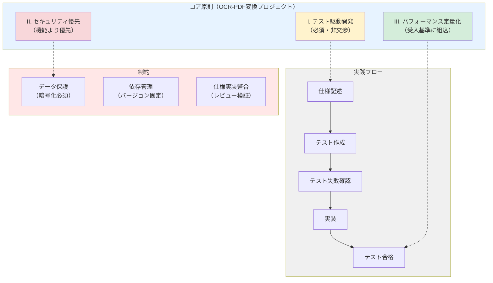
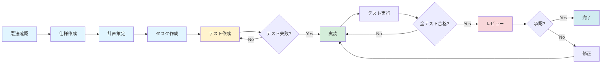
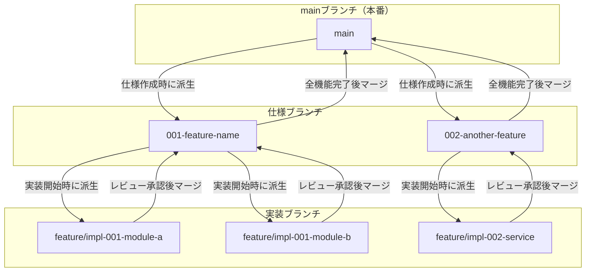

# OCR検索可能PDF変換プロジェクト憲法

## コア原則



### I. テスト駆動開発（必須・非交渉）

**原則**: 仕様に対する検証を必須とし、テストファーストアプローチを徹底する。

**詳細**:
- テストを先に記述し、ユーザーの承認を得た後、テストが失敗することを確認してから実装を開始する（Red-Green-Refactorサイクル）
- 全ての機能要件に対して、受入基準を満たすテストケースを作成する
- 単体テスト、統合テスト、契約テストを適切に組み合わせ、各層で検証を行う
- テストカバレッジを測定し、重要パスについては100%を目指す
- 仕様変更時には、必ず対応するテストを更新または追加する

**根拠**: テストファーストにより、要件の曖昧さを早期に発見し、リグレッションを防止し、リファクタリングの安全性を確保する。

### II. セキュリティ優先

**原則**: セキュリティ要件を機能要件より優先し、データ保護を最優先事項とする。

**詳細**:
- 個人情報、認証情報、その他の機密データは、平文での保存を禁止する
- 機密データは適切な暗号化またはハッシュ化を適用する（暗号化アルゴリズムはAES-256以上、ハッシュはbcrypt/argon2推奨）
- 外部入力は全てサニタイズし、インジェクション攻撃を防止する
- APIエンドポイントには適切な認証・認可メカニズムを実装する
- 依存ライブラリの脆弱性を定期的にスキャンし、速やかに更新する
- セキュリティインシデント発生時の対応手順を文書化する

**根拠**: セキュリティ侵害はユーザー信頼の喪失、法的責任、システム全体の停止につながるため、後からの追加では不十分であり、設計段階から組み込む必要がある。

### III. パフォーマンス定量化

**原則**: パフォーマンス閾値を定量的に定義し、受入基準に組み込む。

**詳細**:
- 各機能の応答時間、スループット、リソース使用量に対して具体的な数値目標を設定する
- 性能要件の例：
  - PDF 1ページ（A4サイズ、300dpi）のOCR処理時間：5秒以内（P95）
  - メモリ使用量：処理中のピーク時でも2GB以内
  - バッチ処理時の並列度：CPU コア数に応じて自動調整
- パフォーマンステストを CI/CD パイプラインに統合し、リグレッションを早期検知する
- ボトルネックを特定するためのプロファイリングツールを活用する
- 性能劣化が検出された場合、原因を特定し修正するまで次のフェーズに進まない

**根拠**: 定量化されていない性能要件は検証不可能であり、ユーザー体験の一貫性を保証できない。明確な基準により、パフォーマンス改善の効果を測定し、継続的な最適化を実現する。

## 制約

### データ保護

- 機密データの平文保存を禁止する（暗号化・ハッシュ化必須）
- OCR処理結果に個人情報が含まれる可能性があるため、適切なアクセス制御と暗号化を実施する
- 処理中の一時ファイルは、処理完了後に確実に削除する
- ログ出力時に機密情報が漏洩しないよう、マスキング処理を実施する

### 依存管理と再現性

- 外部依存パッケージはバージョン固定により再現性を確保する
- `requirements.txt`（pipの場合）または `uv.lock`（uvの場合）を用いて、全ての依存関係を明示的に管理する
- 新しい依存パッケージの追加時には、ライセンス互換性とセキュリティ脆弱性を確認する
- 定期的に依存パッケージを更新し、最新のセキュリティパッチを適用する

### 仕様と実装の整合性

- 仕様と実装の乖離をレビューで検知・是正する
- 実装前に仕様書（spec.md）の承認を必須とする
- コードレビュー時には、実装が仕様と一致しているかを確認する
- 仕様変更が発生した場合、必ず仕様書を更新し、関連するドキュメント（plan.md、tasks.md）も同期する

## 開発ワークフロー

### 作業順序（厳守）

1. **憲法**: プロジェクト憲法（constitution.md）の確認・更新
2. **仕様**: 機能仕様（spec.md）の作成・承認
3. **計画**: 実装計画（plan.md）の策定
4. **タスク**: タスクリスト（tasks.md）の作成
5. **検証**: テストケースの作成・実行（テストファースト）
6. **実装**: 機能の実装
7. **レビュー**: コードレビューと仕様整合性の確認

各フェーズは前のフェーズの完了を前提とし、順序を飛ばすことは許可しない。



### ブランチ戦略

**仕様ブランチ**（mainブランチから派生）:
```bash
git checkout main
git checkout -b wip/<短い名前>
```
例: `001-ocr-pdf-converter`

**実装ブランチ**（仕様ブランチから派生）:
```bash
git checkout 001-ocr-pdf-converter
git checkout -b feature/impl-<番号>-<短い名前>
```
例: `feature/impl-001-ocr-engine`

**マージ戦略**:
- 実装ブランチ → 仕様ブランチ: レビュー承認後にマージ
- 仕様ブランチ → main: 全機能の実装・テスト完了後にマージ



### レビュー規定

- 重大な変更（アーキテクチャ変更、セキュリティ関連、パフォーマンスクリティカル）には、必ず1名以上のレビュー承認を必須とする
- レビュー時の確認項目:
  - 仕様との整合性
  - テストカバレッジ
  - セキュリティリスク
  - パフォーマンスへの影響
  - コード品質（可読性、保守性）

## 開発方針

### 統合開発

- フロントエンド（UIがある場合）とバックエンドを同時に起動するスクリプトを提供する
- 開発環境のセットアップ手順を `README.md` または `docs/quickstart.md` に明記する
- 依存サービス（データベース、外部API等）のモック・スタブを用意し、ローカル開発を容易にする

### 継続的検証

- 正常に動作するまで繰り返し検証し、エラー修正を完了しない限り次のフェーズに進まない
- CI/CD パイプラインで自動テスト・静的解析・セキュリティスキャンを実行する
- 各プルリクエストに対して、全テストがパスすることを必須条件とする

### ドキュメント可視化

- フローチャート、シーケンス図、状態遷移図などを Mermaid 図（v11準拠）で挿入する
- Mermaid v11 対応のベストプラクティス:
  - **gitGraph使用時**: 日本語コミットメッセージを避けるか、flowchart/graph形式を使用する
  - **日本語対応**: flowchart、graph、sequenceDiagramは日本語に完全対応
  - **推奨構文**:
    - ブランチ戦略: `flowchart TB` + `subgraph`
    - プロセスフロー: `flowchart TD/LR`
    - 時系列: `sequenceDiagram`
    - 状態遷移: `stateDiagram-v2`

## ガバナンス

### 憲法の優先度

- 本憲法は、プロジェクトの全ての開発実践に優先する
- 憲法と矛盾する提案や変更は却下される
- 憲法の原則に違反する既存コードは、技術的負債として記録し、優先的に是正する

### 憲法の改定手続き

- 憲法の改定には、以下の手続きを必要とする:
  1. 改定提案書の作成（理由、影響範囲、移行計画を含む）
  2. チームレビューと承認
  3. バージョン番号の更新（セマンティックバージョニングに従う）
  4. 関連ドキュメント（テンプレート、ガイドライン）の同期更新
- バージョニングルール:
  - **MAJOR**: 後方互換性のないガバナンス変更、原則の削除・再定義
  - **MINOR**: 新原則の追加、セクションの実質的拡張
  - **PATCH**: 文言明確化、誤字修正、非意味的な改善

### コンプライアンスレビュー

- 全てのプルリクエスト・レビューは、憲法への準拠を検証する
- 複雑性の導入（新規プロジェクト追加、アーキテクチャパターン採用等）は、明確な正当化を必要とする
- 定期的（四半期ごと）にコンプライアンス監査を実施し、憲法の実効性を評価する

### ランタイムガイダンス

- 開発実行時のガイダンスは、`.github/agents/` および `.github/prompts/` 配下のエージェントファイル・プロンプトファイルを参照する
- エージェント固有の名称（CLAUDE等）は汎用ガイダンスには使用せず、役割ベースの記述（"AI assistant"、"automation agent"等）を使用する

## 品質保証

### ドキュメント品質

- ワークスペース内の全ファイル全文を末尾まで解析する
- トークン制限まで中断せず、全てのタスクを実行する
- トークン制限で中断する場合でも、簡略化など品質を低下させない
- トークン制限まで、生成したドキュメントを繰り返しブラッシュアップする
- 文字化け対策としてUTF-8エンコーディングを使用する
- テンプレートから生成したドキュメントの英語部分を確実に削除し、日本語に置き換える

**Version**: 1.0.0 | **Ratified**: 2026-01-10 | **Last Amended**: 2026-01-10
