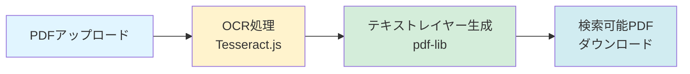
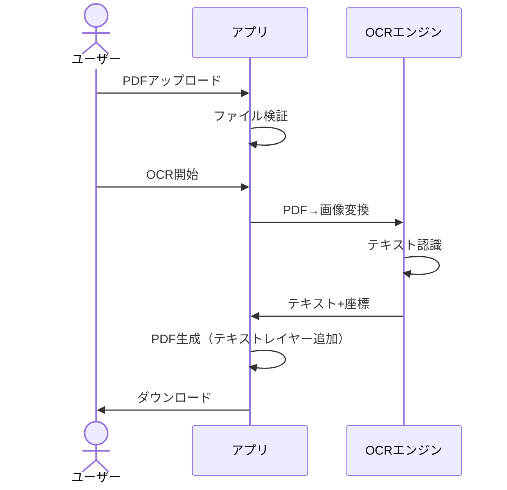
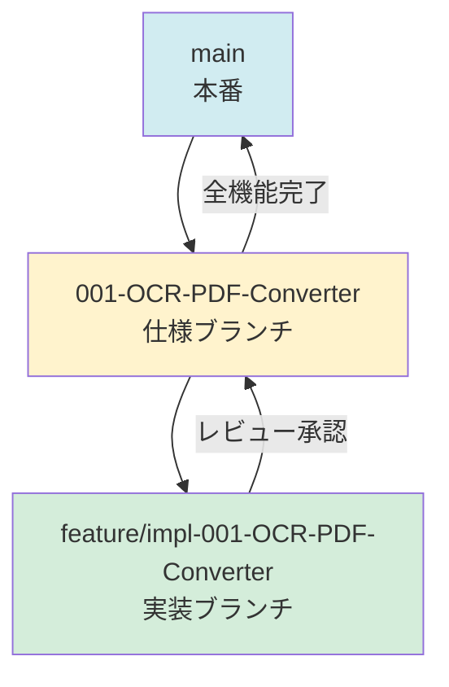

# OCR検索可能PDF変換 Webアプリ

[](LICENSE)
[](https://j1921604.github.io/OCR-PDF-Converter/)
[](https://github.com/J1921604/OCR-PDF-Converter/releases)

**スキャンしたPDFや画像ファイルをOCR処理し、検索可能なテキストレイヤーを追加するWebアプリケーション**

## 特徴

✅ **完全クライアントサイド処理** - アップロードしたファイルはサーバーに送信されません  
✅ **プライバシー保護** - 全ての処理がブラウザ内で完結  
✅ **GitHub Pages対応** - 静的ホスティングで無料公開可能  
✅ **日本語OCR対応** - Tesseract.jsによる高精度日本語認識  
✅ **複数ページ対応** - バッチ処理でリアルタイム進捗表示  
✅ **画像ファイル対応** - JPEG、PNG、TIFFファイルも処理可能  
✅ **多様なサイズ対応** - A3、A4、Letter、Legal等、様々なページサイズに対応  
✅ **クロスブラウザ** - Chrome, Firefox, Edge, Safari対応



## デモ

🌐 **ライブデモ**: [https://j1921604.github.io/OCR-PDF-Converter/](https://j1921604.github.io/OCR-PDF-Converter/)

## クイックスタート

### ワンコマンド起動（PowerShell）

```powershell
.\start-dev.ps1
```

このスクリプトは以下を自動実行します：
1. 依存関係のチェック
2. `npm install`
3. 開発サーバー起動（バックグラウンド）
4. ブラウザで `http://localhost:3000` を自動オープン
5. PowerShellウィンドウを自動終了

### 手動セットアップ

#### 前提条件

- [Node.js](https://nodejs.org/) 18以上
- npm または yarn

#### インストール

```bash
# リポジトリのクローン
git clone https://github.com/J1921604/OCR-PDF-Converter.git
cd OCR-PDF-Converter

# 依存パッケージのインストール
npm install

# 開発サーバー起動
npm start
```

ブラウザで `http://localhost:3000` を開きます。

## 使い方

1. **ファイルを選択**  
   「ファイルを選択」ボタンをクリックし、スキャンしたPDFファイルまたは画像ファイル（10MB以下）を選択します。  
   **対応形式**: PDF、JPEG、PNG、TIFF

2. **OCR変換開始**  
   「OCR変換開始」ボタンをクリックすると、OCR処理が開始されます。  
   進捗バーでリアルタイムに処理状況を確認できます。

3. **検索可能PDFをダウンロード**  
   処理完了後、「ダウンロード」ボタンから検索可能なPDFファイルを保存します。

4. **テキスト検索**  
   ダウンロードしたPDFをPDFビューアー（Adobe Acrobat Reader等）で開き、  
   `Ctrl+F`（Windows）または `Cmd+F`（Mac）でテキスト検索が可能です。



## 技術スタック

| カテゴリ | ライブラリ | バージョン | 用途 |
|----------|-----------|------------|------|
| PDFレンダリング | [PDF.js](https://mozilla.github.io/pdf.js/) | 4.0+ | PDFページを画像化 |
| OCRエンジン | [Tesseract.js](https://tesseract.projectnaptha.com/) | 5.0+ | 日本語OCR処理 |
| PDF生成 | [pdf-lib](https://pdf-lib.js.org/) | 1.17+ | テキストレイヤー追加 |
| UI | React | 18.0+ | ユーザーインターフェース |

## プロジェクト構造

```
OCR-PDF-Converter/
├── specs/                      # 仕様ドキュメント
│   └── 001-OCR-PDF-Converter/
│       ├── spec.md            # 機能仕様
│       ├── requirements.md    # 技術要件
│       └── checklists/        # 品質チェックリスト
├── src/                        # ソースコード（実装予定）
│   ├── components/            # Reactコンポーネント
│   ├── services/              # ビジネスロジック
│   └── utils/                 # ユーティリティ関数
├── public/                     # 静的ファイル
├── .github/                    # GitHub設定
│   ├── workflows/             # CI/CDワークフロー
│   └── prompts/               # 開発ガイド
├── start-dev.ps1              # ワンコマンド起動スクリプト
├── package.json               # 依存関係定義
└── README.md                  # このファイル
```

## 開発

### ブランチ戦略



- **mainブランチ**: 本番環境（GitHub Pages）
- **仕様ブランチ** (`001-OCR-PDF-Converter`): 機能仕様とドキュメント
- **実装ブランチ** (`feature/impl-001-OCR-PDF-Converter`): コード実装

### 開発ワークフロー

1. **憲法確認**: [.specify/memory/constitution.md](.specify/memory/constitution.md) を読む
2. **仕様作成**: `specs/001-OCR-PDF-Converter/spec.md` で要件定義
3. **実装**: `feature/impl-001-OCR-PDF-Converter` ブランチで開発
4. **テスト**: 単体テスト → 統合テスト → E2Eテスト
5. **レビュー**: コードレビューと仕様整合性確認
6. **マージ**: 仕様ブランチ → main

### コマンド

```bash
# 開発サーバー起動
npm start

# ビルド（本番用）
npm run build

# テスト実行
npm test

# Lint実行
npm run lint

# フォーマット
npm run format
```

## GitHub Pages デプロイ

GitHub Actionsで自動デプロイされます。

```yaml
# .github/workflows/deploy.yml
on:
  push:
    branches: [ main ]
```

`main`ブランチにプッシュすると、自動的にビルド→デプロイされます。

## パフォーマンス

- **1ページPDF処理時間**: 5秒以内（P95）
- **10ページPDF処理時間**: 50秒以内（P95）
- **メモリ使用量**: 2GB以下（ピーク時）
- **ファイルサイズ制限**: 10MB

## ブラウザサポート

| ブラウザ | 最小バージョン |
|----------|----------------|
| Chrome | 100+ |
| Firefox | 100+ |
| Edge | 100+ |
| Safari | 15+ |

## ライセンス

[MIT License](LICENSE)

## コントリビューション

プルリクエストを歓迎します！詳細は [CONTRIBUTING.md](CONTRIBUTING.md) を参照してください。

## 謝辞

このプロジェクトは以下のオープンソースライブラリを使用しています：
- [PDF.js](https://mozilla.github.io/pdf.js/) by Mozilla
- [Tesseract.js](https://tesseract.projectnaptha.com/)
- [pdf-lib](https://pdf-lib.js.org/)

## リンク

- 📖 **仕様書**: [specs/001-OCR-PDF-Converter/spec.md](specs/001-OCR-PDF-Converter/spec.md)
- 🛠️ **技術要件**: [specs/001-OCR-PDF-Converter/requirements.md](specs/001-OCR-PDF-Converter/requirements.md)
- ✅ **チェックリスト**: [specs/001-OCR-PDF-Converter/checklists/requirements.md](specs/001-OCR-PDF-Converter/checklists/requirements.md)
- 📜 **プロジェクト憲法**: [.specify/memory/constitution.md](.specify/memory/constitution.md)

---

**作成日**: 2026-01-10  
**バージョン**: 1.0.0  
**メンテナ**: J1921604
