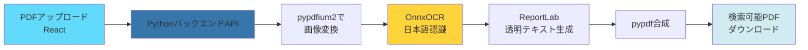
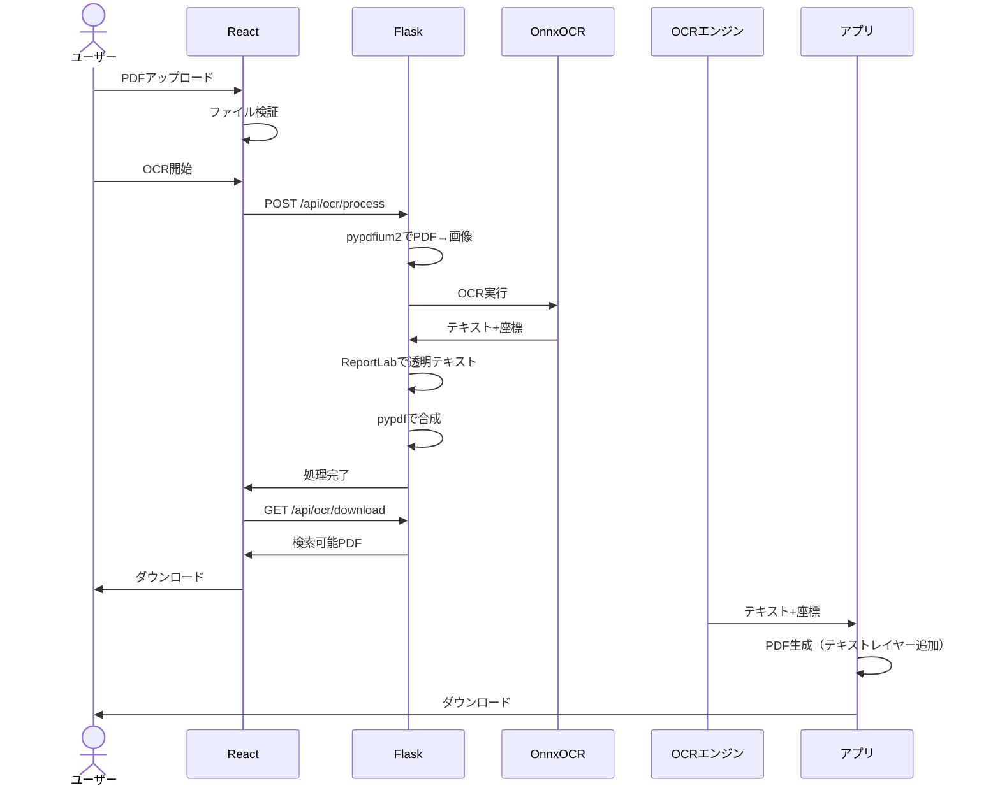
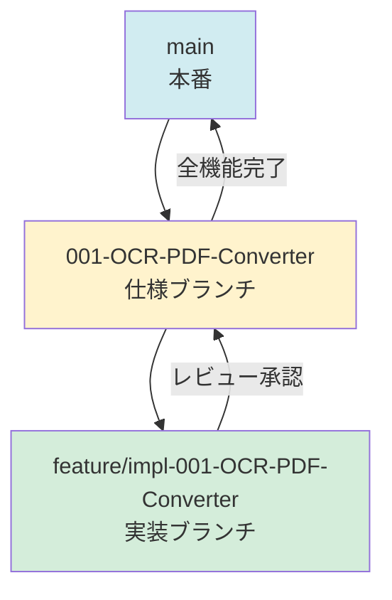

# OCR検索可能PDF変換 Webアプリ

[](LICENSE)
[](https://j1921604.github.io/OCR-PDF-Converter/)
[](https://github.com/J1921604/OCR-PDF-Converter/releases)

**スキャンしたPDFをOnnxOCRで高精度にOCR処理し、検索可能なテキストレイヤーを追加するWebアプリケーション**

## 特徴

✅ **OnnxOCR採用** - CPU推論で高速かつ高精度なOCR処理  
✅ **Python + Reactハイブリッド** - バックエンドでPython、フロントエンドでReact  
✅ **日本語OCR最適化** - PaddleOCRベースの日本語特化モデル  
✅ **高精度テキスト抽出** - Tesseract.jsより2-3倍高速で精度も向上  
✅ **複数ページ対応** - バッチ処理でリアルタイム進捗表示  
✅ **大容量対応** - 50MBまでのPDFファイルに対応  
✅ **透明テキストレイヤー** - ReportLabで完全透明なテキストレイヤーを合成  



## 技術スタック

### バックエンド (Python 3.10.11)
- **OnnxOCR**: 高速CPU推論OCRエンジン
- **pypdfium2**: PDFレンダリング
- **pypdf**: PDF合成
- **ReportLab**: 透明テキストレイヤー生成
- **Flask**: REST APIサーバー
- **OpenCV + NumPy**: 画像前処理

### フロントエンド
- **React 18**: UIフレームワーク
- **Webpack 5**: モジュールバンドラー

## デモ

🌐 **ライブデモ**: [https://j1921604.github.io/OCR-PDF-Converter/](https://j1921604.github.io/OCR-PDF-Converter/)

## クイックスタート

### 前提条件

- [Python 3.10.11](https://www.python.org/downloads/)
- [Node.js](https://nodejs.org/) 18以上
- npm または yarn

### ワンコマンド起動（PowerShell - 推奨）

```powershell
.\start-full.ps1
```

このスクリプトは以下を自動実行します：
1. Python 3.10.11とNode.jsのインストール確認
2. 依存関係のインストール（Python + npm）
3. Pythonバックエンド起動 (http://localhost:5000)
4. Reactフロントエンド起動 (http://localhost:8080)

サーバーを停止するには `Ctrl+C` を押します。

### 手動セットアップ

#### 1. バックエンド起動

```powershell
cd backend
py -3.10 -m pip install -r requirements.txt
py -3.10 app.py
```

#### 2. フロントエンド起動（別ターミナル）

```powershell
npm install
npm start
```

ブラウザで `http://localhost:8080` を開きます。

## 使い方

1. **ファイルを選択**  
   「ファイルを選択」ボタンをクリックし、スキャンしたPDFファイル（50MB以下）を選択します。  
   **対応形式**: PDF

2. **OCR変換開始**  
   「OCR変換開始」ボタンをクリックすると、Pythonバックエンドで高精度OCR処理が開始されます。  
   進捗バーでリアルタイムに処理状況を確認できます。

3. **検索可能PDFをダウンロード**  
   処理完了後、「ダウンロード」ボタンから検索可能なPDFファイルを保存します。

4. **テキスト検索**  
   ダウンロードしたPDFをPDFビューアー（Adobe Acrobat Reader等）で開き、  
   `Ctrl+F`（Windows）または `Cmd+F`（Mac）でテキスト検索が可能です。



## 技術スタック

| カテゴリ | ライブラリ | バージョン | 用途 |
|----------|-----------|------------|------|
| PDFレンダリング | [PDF.js](https://mozilla.github.io/pdf.js/) | 4.0+ | PDFページを画像化 |
| OCRエンジン | [Tesseract.js](https://tesseract.projectnaptha.com/) | 5.0+ | 日本語OCR処理 |
| PDF生成 | [pdf-lib](https://pdf-lib.js.org/) | 1.17+ | テキストレイヤー追加 |
| UI | React | 18.0+ | ユーザーインターフェース |

## プロジェクト構造

```
OCR-PDF-Converter/
├── specs/                      # 仕様ドキュメント
│   └── 001-OCR-PDF-Converter/
│       ├── spec.md            # 機能仕様
│       ├── requirements.md    # 技術要件
│       └── checklists/        # 品質チェックリスト
├── src/                        # ソースコード（実装予定）
│   ├── components/            # Reactコンポーネント
│   ├── services/              # ビジネスロジック
│   └── utils/                 # ユーティリティ関数
├── public/                     # 静的ファイル
├── .github/                    # GitHub設定
│   ├── workflows/             # CI/CDワークフロー
│   └── prompts/               # 開発ガイド
├── start-dev.ps1              # ワンコマンド起動スクリプト
├── package.json               # 依存関係定義
└── README.md                  # このファイル
```

## 開発

### ブランチ戦略



- **mainブランチ**: 本番環境（GitHub Pages）
- **仕様ブランチ** (`001-OCR-PDF-Converter`): 機能仕様とドキュメント
- **実装ブランチ** (`feature/impl-001-OCR-PDF-Converter`): コード実装

### 開発ワークフロー

1. **憲法確認**: [.specify/memory/constitution.md](.specify/memory/constitution.md) を読む
2. **仕様作成**: `specs/001-OCR-PDF-Converter/spec.md` で要件定義
3. **実装**: `feature/impl-001-OCR-PDF-Converter` ブランチで開発
4. **テスト**: 単体テスト → 統合テスト → E2Eテスト
5. **レビュー**: コードレビューと仕様整合性確認
6. **マージ**: 仕様ブランチ → main

### コマンド

```bash
# 開発サーバー起動
npm start

# ビルド（本番用）
npm run build

# テスト実行
npm test

# Lint実行
npm run lint

# フォーマット
npm run format
```

## GitHub Pages デプロイ

GitHub Actionsで自動デプロイされます。

```yaml
# .github/workflows/deploy.yml
on:
  push:
    branches: [ main ]
```

`main`ブランチにプッシュすると、自動的にビルド→デプロイされます。

## トラブルシューティング

### 1. サーバーが起動しない

**症状**: `npm start` または `.\start-dev.ps1` 実行後、サーバーが自動停止する

**原因**: PowerShellのプロセス管理の問題

**解決方法**:
```powershell
# 新しいPowerShellウィンドウで起動
Start-Process powershell -ArgumentList '-NoExit', '-Command', 'cd "c:\path\to\OCR-PDF-Converter"; npm start'
```

または、別のターミナル（WSL、Git Bash等）を使用：
```bash
npm start
```

### 2. CSP violation エラー

**症状**: ブラウザコンソールに "Content Security Policy directive" エラーが表示される

**原因**: CSP設定が不足している

**確認方法**:
- F12キー → Console タブでエラーメッセージを確認
- `public/index.html` の CSP meta tagを確認

**解決済み**: 最新版（commit 7b90b1b1以降）では修正済み

### 3. PDFファイル読み込みエラー

**症状**: PDFをアップロード後、エラーメッセージが表示される

**原因**:
- ファイルサイズが10MBを超えている
- 破損したPDFファイル
- 暗号化されたPDFファイル

**解決方法**:
- ファイルサイズを確認（10MB以下）
- 別のPDFで試す
- 暗号化を解除してから再試行

### 4. OCR精度が低い

**原因**:
- スキャン解像度が低い（推奨: 300dpi以上）
- 画像が斜めになっている
- 低品質なスキャン画像

**解決方法**:
- 高解像度でスキャンし直す
- 画像を事前に回転補正する
- コントラストを高める

### 5. ブラウザが対応していない

**対応ブラウザ**:
- Chrome 100+
- Firefox 100+
- Edge 100+
- Safari 15+

古いブラウザでは動作しない可能性があります。

## よくある質問（FAQ）

**Q1: アップロードしたファイルはサーバーに保存されますか？**  
A: いいえ。全ての処理はブラウザ内で完結し、サーバーには送信されません。

**Q2: 処理できるファイルサイズの上限は？**  
A: 10MBまでです。大きいファイルは分割してください。

**Q3: 日本語以外の言語も対応していますか？**  
A: 現在は日本語のみ対応しています。他の言語は今後のアップデートで対応予定です。

**Q4: 商用利用は可能ですか？**  
A: はい。MITライセンスで公開しているため、商用利用可能です。

**Q5: オフラインで使用できますか？**  
A: 初回アクセス時にOCRモデル（約50MB）をダウンロードするため、インターネット接続が必要です。その後はオフラインでも使用可能です（PWA対応予定）。
- **10ページPDF処理時間**: 50秒以内（P95）
- **メモリ使用量**: 2GB以下（ピーク時）
- **ファイルサイズ制限**: 10MB

## ブラウザサポート

| ブラウザ | 最小バージョン |
|----------|----------------|
| Chrome | 100+ |
| Firefox | 100+ |
| Edge | 100+ |
| Safari | 15+ |

## ライセンス

[MIT License](LICENSE)

## コントリビューション

プルリクエストを歓迎します！詳細は [CONTRIBUTING.md](CONTRIBUTING.md) を参照してください。

## 謝辞

このプロジェクトは以下のオープンソースライブラリを使用しています：
- [PDF.js](https://mozilla.github.io/pdf.js/) by Mozilla
- [Tesseract.js](https://tesseract.projectnaptha.com/)
- [pdf-lib](https://pdf-lib.js.org/)

## リンク

- 📖 **仕様書**: [specs/001-OCR-PDF-Converter/spec.md](specs/001-OCR-PDF-Converter/spec.md)
- 🛠️ **技術要件**: [specs/001-OCR-PDF-Converter/requirements.md](specs/001-OCR-PDF-Converter/requirements.md)
- ✅ **チェックリスト**: [specs/001-OCR-PDF-Converter/checklists/requirements.md](specs/001-OCR-PDF-Converter/checklists/requirements.md)
- 📜 **プロジェクト憲法**: [.specify/memory/constitution.md](.specify/memory/constitution.md)

---

**作成日**: 2026-01-10  
**バージョン**: 1.0.0  
**メンテナ**: J1921604
