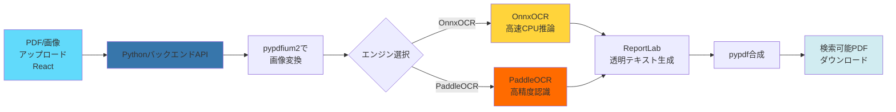
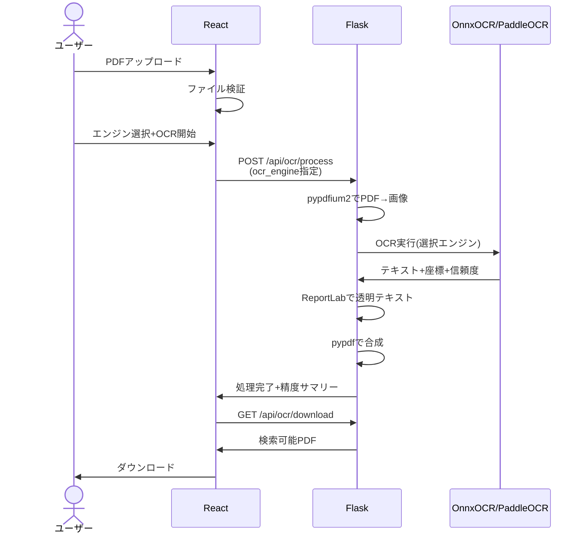

# OCR検索可能PDF変換 Webアプリ

[](LICENSE)
[](https://j1921604.github.io/OCR-PDF-Converter/)
[](https://github.com/J1921604/OCR-PDF-Converter/releases)

**スキャンしたPDFや画像を高精度OCRエンジン（OnnxOCR・PaddleOCR）で処理し、検索可能なテキストレイヤーを追加するWebアプリケーション**

## 特徴

✅ **高精度OCRエンジン** - OnnxOCR（高速CPU推論）、PaddleOCR（高精度）から選択可能  
✅ **OCRエンジン選択** - UI上でエンジンを切り替えて最適な結果を選択  
✅ **画像ファイル対応** - JPEG、PNG、TIFF画像も直接OCR処理可能  
✅ **Python + Reactハイブリッド** - バックエンドでPython、フロントエンドでReact  
✅ **日本語OCR最適化** - 日本語に特化した高精度認識  
✅ **複数ページ対応** - バッチ処理でリアルタイム進捗表示  
✅ **ファイル制限** - 最大50MB対応  
✅ **透明テキストレイヤー** - ReportLabで完全透明なテキストレイヤーを合成  
✅ **ダークモードUI** - 黒とオレンジを基調とした立体的で金属的なデザイン  
✅ **A4以外対応** - A3、Letter、Legal、カスタムサイズにも対応  



## 技術スタック

### バックエンド (Python 3.10.11)
- **OnnxOCR 2025.5**: 高速CPU推論OCRエンジン（PaddleOCRベース）
- **PaddleOCR 2.7.0.3**: 高精度多機能OCRエンジン
- **pypdfium2 4.30**: PDFレンダリング
- **pypdf 3.17**: PDF合成
- **ReportLab 4.0**: 透明テキストレイヤー生成
- **Flask 3.0**: REST APIサーバー
- **OpenCV 4.6**: 画像前処理
- **NumPy 1.24**: 数値計算
- **Pillow 10.4**: 画像処理

### フロントエンド
- **React 18**: UIフレームワーク
- **Webpack 5**: モジュールバンドラー

## デモ

🌐 **ライブデモ（UIのみ）**: [https://j1921604.github.io/OCR-PDF-Converter/](https://j1921604.github.io/OCR-PDF-Converter/)

※GitHub Pages（HTTPS）上のフロントエンドから `http://localhost:5000` を呼ぶことは mixed content でブロックされるため、Pages単体ではOCR処理は動きません。OCRを動かす場合はローカル起動してください。

## クイックスタート

### 前提条件

- [Python 3.10.11](https://www.python.org/downloads/)
- [Node.js](https://nodejs.org/) 18以上
- npm または yarn

### ワンコマンド起動（PowerShell - 推奨）

```powershell
.\start-full.ps1
```

このスクリプトは以下を自動実行します：
1. Python 3.10.11とNode.jsのインストール確認
2. 依存関係のインストール（Python + npm）
3. Pythonバックエンド起動 (http://localhost:5000)
4. Reactフロントエンド起動 (http://localhost:8080)

サーバーを停止するには `Ctrl+C` を押します。

### 手動セットアップ

#### 1. バックエンド起動

```powershell
py -3.10 -m venv .venv
.\.venv\Scripts\Activate.ps1
py -3.10 -m pip install --upgrade pip
py -3.10 -m pip install -r requirements.txt
python backend\app.py
```

#### 2. フロントエンド起動（別ターミナル）

```powershell
npm install
npm start
```

ブラウザで `http://localhost:8080` を開きます。

## 使い方

1. **ファイルを選択**  
   「ファイルを選択」ボタンをクリックし、スキャンしたPDFファイルまたは画像ファイル（JPEG、PNG、TIFF、50MB以下）を選択します。  
   **対応形式**: PDF / JPEG / PNG / TIFF（画像はフロント側でPDFに変換してから送信します）

2. **OCR変換開始**  
   OCRエンジン（OnnxOCR または PaddleOCR）を選択し、「OCR変換開始」ボタンをクリックすると、Pythonバックエンドで以下の処理が実行されます：
   - 選択されたOCRエンジンでPDFの各ページをOCR処理
   - OCR精度（平均信頼度）をリアルタイム表示
   - 進捗バーでリアルタイムに処理状況を確認



## 技術スタック

### バックエンド (Python 3.10.11)

| カテゴリ | ライブラリ | バージョン | 用途 |
|----------|-----------|------------|------|
| OCRエンジン | [OnnxOCR](https://github.com/hiroi-sora/Umi-OCR) | 2025.5+ | 高速CPU推論OCR |
| OCRエンジン | [PaddleOCR](https://github.com/PaddlePaddle/PaddleOCR) | 2.7.0.3+ | 高精度多機能OCR |
| PDFレンダリング | [pypdfium2](https://github.com/pypdfium2-team/pypdfium2) | 4.30+ | PDF→画像変換 |
| PDF合成 | [pypdf](https://github.com/py-pdf/pypdf) | 3.17+ | PDFページ操作 |
| テキストレイヤー | [ReportLab](https://www.reportlab.com/) | 4.0+ | 透明テキスト生成 |
| Web API | [Flask](https://flask.palletsprojects.com/) | 3.0+ | REST APIサーバー |
| 画像処理 | OpenCV + NumPy | 4.6+ / 1.24+ | 前処理 |
| 画像処理 | Pillow | 10.4+ | 画像読み込み・変換 |

### フロントエンド

| カテゴリ | ライブラリ | バージョン | 用途 |
|----------|-----------|------------|------|
| UIフレームワーク | [React](https://react.dev/) | 18.2+ | SPA構築 |
| モジュールバンドラー | [Webpack](https://webpack.js.org/) | 5.104+ | ビルドツール |

   進捗バーでリアルタイムに処理状況を確認できます。

3. **検索可能PDFをダウンロード**  
   処理完了後、「ダウンロード」ボタンから検索可能なPDFファイルを保存します。

4. **テキスト検索**  
   ダウンロードしたPDFをPDFビューアー（Adobe Acrobat Reader等）で開き、  
   `Ctrl+F`（Windows）または `Cmd+F`（Mac）でテキスト検索が可能です。

## プロジェクト構造

```
OCR-PDF-Converter/
├── backend/                    # Pythonバックエンド
│   ├── app.py                 # Flask APIサーバー
│   ├── main.py                # OCRエンジン実装
│   └── (注) requirements.txt はリポジトリ直下
├── specs/                      # 仕様ドキュメント
│   └── 001-OCR-PDF-Converter/
│       ├── spec.md            # 機能仕様
│       ├── requirements.md    # 技術要件
│       ├── tasks.md           # タスクリスト
│       └── checklists/        # 品質チェックリスト
├── src/                        # Reactフロントエンド
│   ├── components/            # UIコンポーネント
│   ├── hooks/                 # カスタムHook
│   ├── services/              # API連携サービス
│   └── utils/                 # ユーティリティ関数
├── public/                     # 静的ファイル
├── cypress/                    # E2Eテスト
│   └── e2e/
│       └── ocr-converter.cy.js
├── tests/                      # 単体テスト
│   └── unit/
├── .github/                    # GitHub設定
│   └── workflows/
│       └── pages.yml          # GitHub Actionsデプロイ
├── start-full.ps1             # ワンコマンド起動スクリプト
├── package.json               # npm依存関係
└── README.md                  # このファイル
```

## 開発

### ブランチ戦略

プロジェクト憲法（`.specify/memory/constitution.md`）に従い、基本は **main単一運用**です。
必要に応じて短命の作業ブランチ（例: `wip/<topic>`）を切ってもよいですが、最終的にmainへマージしてブランチは削除します。

### 開発ワークフロー

1. **憲法確認**: https://github.com/J1921604/OCR-PDF-Converter/blob/main/.specify/memory/constitution.md を読む
2. **仕様作成**: `specs/001-OCR-PDF-Converter/spec.md` で要件定義
3. **実装**: `feature/impl-001-OCR-PDF-Converter` ブランチで開発
4. **テスト**: 単体テスト → 統合テスト → E2Eテスト
5. **レビュー**: コードレビューと仕様整合性確認
6. **マージ**: 仕様ブランチ → main

### コマンド

```bash
# 開発サーバー起動
npm start

# ビルド（本番用）
npm run build

# テスト実行
npm test

# Lint実行
npm run lint

# フォーマット
npm run format
```

## GitHub Pages デプロイ

GitHub Actionsで自動デプロイされます。

※デプロイされるのはフロントエンド（静的ファイル）のみです。OCR処理にはバックエンドが必要です。

```yaml
# .github/workflows/pages.yml
on:
  push:
    branches: [ main ]
```

`main`ブランチにプッシュすると、自動的にビルド→デプロイされます。

## トラブルシューティング

### 1. サーバーが起動しない

**症状**: `npm start` または `.\start-dev.ps1` 実行後、サーバーが自動停止する

**解決方法**:

- まず `\.\start-full.ps1` の利用を推奨します（同一ウィンドウ内で安定起動/停止します）。
- 8080/5000番ポートが他プロセスで使用中の場合は、先に停止してから再実行してください。

### 2. CSP violation エラー

**症状**: ブラウザコンソールに "Content Security Policy directive" エラーが表示される

**原因**: CSP設定が不足している

**確認方法**:
- F12キー → Console タブでエラーメッセージを確認
- `public/index.html` の CSP meta tagを確認

**補足**: API接続先（`connect-src`）やワーカー（`worker-src`）の許可が不足していると発生します。

### 3. PDFファイル読み込みエラー

**症状**: PDFをアップロード後、エラーメッセージが表示される

**原因**:
- ファイルサイズが50MBを超えている
- 破損したPDFファイル
- 暗号化されたPDFファイル

**解決方法**:
- ファイルサイズを確認（50MB以下）
- 別のPDFで試す
- 暗号化を解除してから再試行

### 4. OCR精度が低い

**原因**:
- スキャン解像度が低い（推奨: 300dpi以上）
- 画像が斜めになっている
- 低品質なスキャン画像

**解決方法**:
- OCR処理は選択したエンジン（OnnxOCR/PaddleOCR）で自動的に300dpiで処理します
- 高解像度でスキャンし直す
- コントラストを高める

## パフォーマンス指標

- **1ページPDF処理時間**: 5秒以内（P95、OnnxOCR CPU推論）
- **10ページPDF処理時間**: 50秒以内（P95）
- **メモリ使用量**: Python 512MB、React 256MB（ピーク時）
- **ファイルサイズ制限**: 50MB

## よくある質問（FAQ）

**Q1: バックエンドサーバーはどこで動作しますか？**  
A: Pythonバックエンドはローカル環境（localhost:5000）で動作します。サーバーへのファイル送信は行われません。

**Q2: 処理できるファイルサイズの上限は？**  
A: 最大50MBまで対応しています。

**Q3: 日本語以外の言語も対応していますか？**  
A: OnnxOCRとPaddleOCRは多言語対応（日本語、英語、中国語など）ですが、現在は日本語に最適化しています。

**Q4: 商用利用は可能ですか？**  
A: はい。MITライセンスで公開しているため、商用利用可能です。

**Q5: オフラインで使用できますか？**  
A: Python環境とOCRモデルが事前にインストールされていれば、完全オフラインで使用可能です。

## ブラウザサポート

| ブラウザ | 最小バージョン |
|----------|----------------|
| Chrome | 100+ |
| Firefox | 100+ |
| Edge | 100+ |
| Safari | 15+ |

## ライセンス

[MIT License](LICENSE)

## コントリビューション

プルリクエストを歓迎します！

## 謝辞

このプロジェクトは以下のオープンソースライブラリを使用しています：
- [OnnxOCR](https://github.com/hiroi-sora/Umi-OCR) - 高速CPU推論OCRエンジン
- [PaddleOCR](https://github.com/PaddlePaddle/PaddleOCR) - 高精度多機能OCRエンジン
- [pypdfium2](https://github.com/pypdfium2-team/pypdfium2) - PDFレンダリング
- [pypdf](https://github.com/py-pdf/pypdf) - PDF操作
- [ReportLab](https://www.reportlab.com/) - PDFテキストレイヤー生成
- [React](https://react.dev/) - UIフレームワーク

## リンク

- 📖 **仕様書**: https://github.com/J1921604/OCR-PDF-Converter/blob/main/specs/001-OCR-PDF-Converter/spec.md
- 🛠️ **技術要件**: https://github.com/J1921604/OCR-PDF-Converter/blob/main/specs/001-OCR-PDF-Converter/requirements.md
- ✅ **チェックリスト**: https://github.com/J1921604/OCR-PDF-Converter/blob/main/specs/001-OCR-PDF-Converter/checklists/requirements.md
- 📜 **プロジェクト憲法**: https://github.com/J1921604/OCR-PDF-Converter/blob/main/.specify/memory/constitution.md

---

**作成日**: 2026-1-15  
**バージョン**: 1.0.0  
**メンテナ**: J1921604
