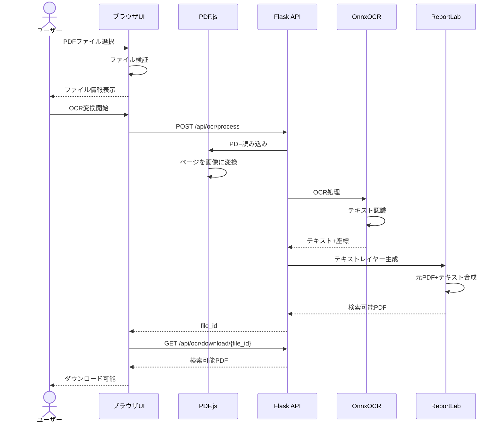
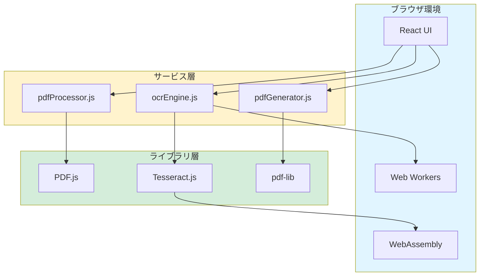
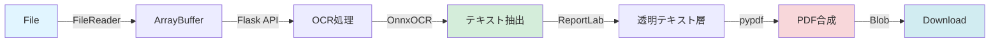
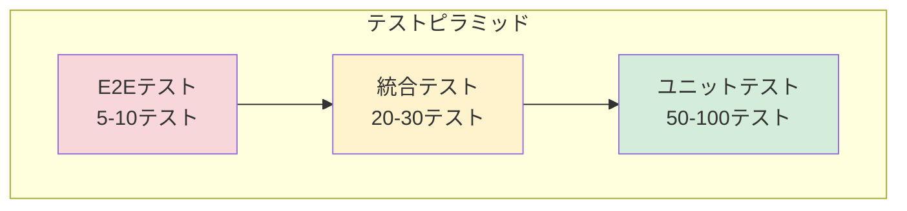

# OCR検索可能PDF変換Webアプリ - 完全仕様書

**バージョン**: 1.0.0  
**最終更新**: 2026-1-15  
**リポジトリ**: https://github.com/J1921604/OCR-PDF-Converter  
**GitHub Pages（UIデモ）**: https://j1921604.github.io/OCR-PDF-Converter/

関連ドキュメント:

- 仕様: https://github.com/J1921604/OCR-PDF-Converter/blob/main/specs/001-OCR-PDF-Converter/spec.md
- 技術要件: https://github.com/J1921604/OCR-PDF-Converter/blob/main/specs/001-OCR-PDF-Converter/requirements.md
- 計画: https://github.com/J1921604/OCR-PDF-Converter/blob/main/specs/001-OCR-PDF-Converter/plan.md
- タスク: https://github.com/J1921604/OCR-PDF-Converter/blob/main/specs/001-OCR-PDF-Converter/tasks.md

---

## 目次

1. [概要](#概要)
2. [システム構成](#システム構成)
3. [機能仕様](#機能仕様)
4. [非機能要件](#非機能要件)
5. [API仕様](#api仕様)
6. [データの扱い](#データの扱い)
7. [テスト方針](#テスト方針)
8. [デプロイ/配布](#デプロイ配布)
9. [運用・保守](#運用保守)

---

## 1. プロジェクト概要

### 1.1 背景と目的

スキャンしたPDFファイルは、見た目は文書として認識できても、コンピューターにとっては単なる画像の集合体です。このため、テキスト検索や複製ができず、情報の活用が制限されます。

**本アプリケーションの目的**:
- スキャンPDFを検索可能なPDFに変換
- ブラウザ内で完結する処理（プライバシー保護）
- 誰でも無料で利用できるWebアプリケーション

### 1.2 主要機能

1. **PDFアップロード**: ブラウザから直接PDFファイルをアップロード（10MB以下）
2. **OCR処理**: WebAssemblyベースのTesseract.jsで日本語テキストを認識
3. **テキストレイヤー生成**: 認識したテキストを元のPDFに透明レイヤーとして埋め込み
4. **複数ページ対応**: 複数ページPDFのバッチ処理とリアルタイム進捗表示
5. **画像ファイル対応**: JPEG、PNG、TIFFファイルを自動的にPDFに変換
6. **検索可能PDF出力**: 検索とコピーが可能なPDFファイルのダウンロード

### 1.3 技術スタック

| レイヤー | 技術 | バージョン |
|---------|-----|-----------|
| フロントエンド | React | 18.2.0 |
| PDFレンダリング | PDF.js | 4.0.379 |
| OCRエンジン | OnnxOCR (Python) | 2025.5 |
| PDF生成 | pypdf + ReportLab | 5.1.0 + 4.2.0 |
| バックエンド | Flask | 3.0.0 |
| ビルドツール | Webpack | 5.104.1 |
| テスト | Jest + Cypress | 29.7.0 + 13.6.0 |
| ホスティング | GitHub Pages (フロントのみ) | - |
| CI/CD | GitHub Actions | - |

### 1.4 プロジェクト構造

```
OCR-PDF-Converter/
├── public/                 # 静的ファイル
│   ├── index.html         # HTMLテンプレート
│   └── manifest.json      # PWAマニフェスト
├── src/                   # ソースコード
│   ├── components/        # Reactコンポーネント
│   │   ├── FileUploader.jsx
│   │   ├── OCRProgress.jsx
│   │   ├── DownloadButton.jsx
│   │   └── App.jsx
│   ├── services/          # ビジネスロジック
│   │   ├── pdfProcessor.js
│   │   └── pdfGenerator.js
│   ├── hooks/             # カスタムReactフック
│   │   ├── useFileUpload.js
│   │   └── useOCR.js
│   ├── utils/             # ユーティリティ関数
│   │   ├── fileValidator.js
│   │   ├── coordinateConverter.js
│   │   └── errorHandler.js
│   ├── styles/            # スタイルシート
│   │   └── main.css
│   └── index.jsx          # エントリーポイント
├── tests/                 # テストファイル
│   ├── unit/             # ユニットテスト
│   ├── integration/      # 統合テスト
│   └── e2e/              # E2Eテスト
├── docs/                  # ドキュメント
│   ├── DEPLOY_GUIDE.md
│   └── 完全仕様書.md
├── specs/                 # 仕様書
│   └── 001-OCR-PDF-Converter/
│       ├── spec.md
│       ├── requirements.md
│       ├── plan.md
│       ├── research.md
│       ├── data-model.md
│       ├── quickstart.md
│       └── tasks.md
├── .github/
│   └── workflows/         # GitHub Actionsワークフロー
│       └── pages.yml
├── package.json
├── webpack.config.js
└── README.md
```

---

## 2. 機能仕様

### 2.1 ユーザーストーリー

#### ユーザーストーリー 1: PDFアップロードとOCR変換 (P1)

**優先度**: P1（最高優先度 - MVP）

**説明**: ユーザーはスキャンされたPDFファイルをブラウザからアップロードし、OCR処理を実行して、検索可能なテキストレイヤーを含むPDFをダウンロードできる。

**受入基準**:
1. PDFファイル（10MB以下）を選択できる
2. ファイル名とファイルサイズが表示される
3. OCR変換ボタンをクリックすると処理が開始される
4. 処理完了後、ダウンロードボタンが表示される
5. ダウンロードしたPDFでテキスト検索（Ctrl+F）が可能

**処理フロー**:



#### ユーザーストーリー 2: 複数ページPDFのバッチ処理 (P2)

**優先度**: P2（高優先度）

**説明**: ユーザーは複数ページを含むPDFファイルをアップロードし、全ページに対してOCR処理を一括実行できる。進捗状況がリアルタイムで表示される。

**受入基準**:
1. 複数ページPDF（10ページまで）を処理できる
2. 「ページ X/Y 処理中...」形式で進捗を表示
3. 進捗バーが処理状況を視覚的に表示
4. 全ページ完了後、ダウンロード可能
5. 全ページでテキスト検索が可能

**並列処理戦略**:
- 最大4つの並列ワーカーで処理
- バッチサイズ: 4ページ
- メモリ管理: 処理済みページはメモリから解放

#### ユーザーストーリー 3: OCR結果プレビューと編集 (P3)

**優先度**: P3（中優先度 - 将来機能）

**説明**: ユーザーはOCR処理後、認識されたテキストをプレビュー表示し、誤認識箇所を手動修正してからPDFを生成できる。

**受入基準**:
1. プレビューボタンでOCR結果を表示
2. テキストボックスで個別に編集可能
3. 修正内容がリアルタイムで反映
4. PDF生成ボタンで最終PDF出力

#### ユーザーストーリー 4: 画像ファイル対応 (P2)

**優先度**: P2（高優先度）

**説明**: ユーザーはJPEG、PNG、TIFF形式の画像ファイルを直接アップロードでき、システムが自動的にPDFに変換してOCR処理を実行する。

**受入基準**:
1. JPEG、PNG、TIFF画像を選択できる
2. 画像がPDFに自動変換される
3. 変換後のPDFでOCR処理が実行される
4. 画像サイズに応じて適切なPDFページサイズが設定される

#### ユーザーストーリー 5: 多様なページサイズ対応 (P2)

**優先度**: P2（高優先度）

**説明**: ユーザーはA4以外のページサイズ（A3、Letter、Legal、B4等）のPDFをアップロードでき、システムが自動的に適切な解像度でOCR処理を実行する。

**受入基準**:
1. A3、A4、B4、Letter、Legal、カスタムサイズに対応
2. ページサイズを自動検出
3. 各サイズに応じて300dpi基準で正規化
4. すべてのサイズで正確なOCR処理が可能

### 2.2 エッジケースとエラーハンドリング

| エッジケース | 対応 |
|------------|------|
| 10MBを超えるPDF | エラーメッセージ「ファイルサイズは10MB以下にしてください」を表示 |
| 非対応ファイル形式 | エラーメッセージ「対応形式: PDF, JPEG, PNG, TIFFのみ」を表示 |
| 破損したPDF | エラーメッセージ「PDFファイルが破損しています」を表示 |
| 処理タイムアウト | 10秒/ページでタイムアウト、再試行を促す |
| メモリ不足 | エラーメッセージ「メモリ不足です。ページ数を減らしてください」を表示 |
| 既に検索可能なPDF | メッセージ「このPDFは既に検索可能です」を表示（OCRスキップ） |

---

## 3. 技術要件

### 3.1 機能要件

| ID | 要件 | 優先度 |
|----|------|--------|
| FR-001 | PDF/画像ファイル（10MB以下）をブラウザからアップロード | P1 |
| FR-002 | PDFページを300dpi基準で画像としてレンダリング | P1 |
| FR-003 | OCR処理で日本語テキストと座標情報を抽出 | P1 |
| FR-004 | 透明テキストレイヤーを元のPDFに重ねて合成 | P1 |
| FR-005 | 検索可能PDFのダウンロード | P1 |
| FR-006 | 複数ページPDFの進捗表示 | P2 |
| FR-007 | エラー通知の明示的な表示 | P1 |
| FR-008 | 完全クライアントサイド処理（バックエンド不要） | P1 |
| FR-009 | ブラウザ内のみで処理（サーバー送信なし） | P1 |
| FR-010 | ファイル形式検証とエラーメッセージ | P1 |
| FR-011 | 多様なページサイズ対応（A3/A4/Letter/Legal等） | P2 |
| FR-012 | 画像ファイル（JPEG/PNG/TIFF）の自動PDF変換 | P2 |

### 3.2 非機能要件

#### 3.2.1 パフォーマンス

| メトリクス | 目標値 | 測定方法 |
|-----------|-------|---------|
| 1ページOCR処理時間 | 5秒以内（P95） | PerformanceObserver API |
| 10ページOCR処理時間 | 50秒以内（P95） | 自動テスト |
| ページ読み込み時間 | 3秒以内（P95） | Lighthouse |
| メモリ使用量（ピーク） | 2GB以下 | Chrome DevTools |
| バンドルサイズ | 5MB以下（WASM含む） | webpack-bundle-analyzer |

#### 3.2.2 信頼性

- **可用性**: 99.9%（GitHub Pagesの可用性に依存）
- **エラー率**: 1%未満（正常なPDFファイルで）
- **OCR精度**: 90%以上（標準的な印刷品質）

#### 3.2.3 互換性

| ブラウザ | 最小バージョン | 対応状況 |
|---------|---------------|---------|
| Chrome | 100+ | 完全対応 |
| Firefox | 100+ | 完全対応 |
| Edge | 100+ | 完全対応 |
| Safari | 15+ | 完全対応 |

#### 3.2.4 セキュリティ

- **データ送信**: 外部サーバーへの送信なし
- **ブラウザ内処理**: 全処理をクライアントサイドで完結
- **HTTPS**: GitHub Pagesで自動提供
- **CSP**: Content Security Policy設定済み
- **データ削除**: 処理完了後、メモリから自動削除

### 3.3 技術制約

- **ファイルサイズ上限**: 10MB
- **対応言語**: 日本語（OCR）、日本語（UI）
- **必須技術**: WebAssembly対応ブラウザ
- **ネットワーク**: 初回ロード時のみ必要（Service Workerでオフライン可能）

---

## 4. 実装計画

### 4.1 アーキテクチャ

#### 4.1.1 システムアーキテクチャ



#### 4.1.2 コンポーネント設計

**プレゼンテーション層**:
- `App.jsx`: ルートコンポーネント、状態管理
- `FileUploader.jsx`: ファイルアップロードUI
- `OCRProgress.jsx`: 進捗バー表示
- `DownloadButton.jsx`: ダウンロードボタン

**ビジネスロジック層**:
- `pdfProcessor.js`: PDF読み込みと画像変換
- `ocrEngine.js`: OCR処理の実行
- `pdfGenerator.js`: テキストレイヤー生成とPDF合成

**ユーティリティ層**:
- `fileValidator.js`: ファイル検証
- `coordinateConverter.js`: 座標変換
- `errorHandler.js`: エラーハンドリング

### 4.2 実装フェーズ

#### Phase 1: Setup（T001-T014）
- プロジェクト構造作成
- 依存関係インストール
- 設定ファイル作成（webpack、babel、ESLint等）

#### Phase 2: Foundational（T015-T032）
- ユーティリティ層実装
- サービス層実装
- ユニットテスト作成

#### Phase 3: User Story 1 - MVP（T033-T050）
- React コンポーネント実装
- カスタムフック実装
- 統合テストとE2Eテスト

#### Phase 4: User Story 2 - Batch Processing（T051-T059）
- 複数ページ処理実装
- 進捗表示機能
- バッチ処理テスト

#### Phase 5: User Story 3 - Preview & Edit（T060-T070）
- プレビュー機能（将来実装）
- 編集機能（将来実装）

#### Phase 6: Image Support（T071-T080）
- JPEG/PNG/TIFF対応
- 画像→PDF変換
- 画像処理テスト

#### Phase 7: Page Sizes（T081-T088）
- A3/Letter/Legal対応
- ページサイズ自動検出
- 多様なサイズテスト

#### Phase 8: Polish（T089-T106）
- パフォーマンス最適化
- アクセシビリティ改善
- ドキュメント整備
- GitHub Pagesデプロイ

---

## 5. データモデル

### 5.1 主要エンティティ

#### 5.1.1 PDFFile

```typescript
interface PDFFile {
  name: string;           // ファイル名
  size: number;          // ファイルサイズ（バイト）
  mimeType: string;      // MIMEタイプ
  arrayBuffer: ArrayBuffer;  // ファイルデータ
  pageCount: number;     // ページ数
}
```

#### 5.1.2 PDFPage

```typescript
interface PDFPage {
  pageNumber: number;    // ページ番号（1始まり）
  width: number;         // 幅（ポイント）
  height: number;        // 高さ（ポイント）
  canvas: HTMLCanvasElement;  // レンダリング結果
  imageData: ImageData;  // 画像データ
}
```

#### 5.1.3 OCRResult

```typescript
interface OCRResult {
  items: OCRItem[];      // 認識されたテキスト項目
  confidence: number;    // 全体の信頼度（0-100）
  imageHeight: number;   // 画像の高さ（座標変換用）
}

interface OCRItem {
  text: string;          // 認識されたテキスト
  bbox: BoundingBox;     // バウンディングボックス
  confidence: number;    // 信頼度（0-1）
}

interface BoundingBox {
  x0: number;  // 左上X座標
  y0: number;  // 左上Y座標
  x1: number;  // 右下X座標
  y1: number;  // 右下Y座標
}
```

#### 5.1.4 TextLayerItem

```typescript
interface TextLayerItem {
  text: string;       // テキスト内容
  x: number;          // X座標（PDFポイント）
  y: number;          // Y座標（PDFポイント）
  width: number;      // 幅（PDFポイント）
  height: number;     // 高さ（PDFポイント）
  fontSize: number;   // フォントサイズ
  confidence: number; // 信頼度
}
```

### 5.2 データフロー



---

## 6. テスト戦略

### 6.1 テストピラミッド



### 6.2 テストカバレッジ目標

| レイヤー | カバレッジ目標 |
|---------|--------------|
| ユニットテスト | 80%以上 |
| 統合テスト | 70%以上 |
| E2Eテスト | 主要フロー100% |

### 6.3 テストツール

- **ユニットテスト**: Jest + @testing-library/react
- **統合テスト**: React Testing Library
- **E2Eテスト**: Cypress
- **パフォーマンステスト**: Lighthouse CI

### 6.4 主要テストケース

#### ユニットテスト
- fileValidator: MIME type検証、ファイルサイズ検証
- coordinateConverter: 座標変換、フォントサイズ計算
- errorHandler: カスタムエラークラス、エラーメッセージ変換
- pdfProcessor: PDF読み込み、ページレンダリング
- ocrEngine: OCR実行、結果フィルタリング
- pdfGenerator: テキストレイヤー生成、PDF合成

#### 統合テスト
- PDFアップロード → OCR → ダウンロード
- 複数ページPDF処理
- 画像ファイル処理
- エラーハンドリング

#### E2Eテスト
- 正常系: PDFアップロード → OCR変換 → ダウンロード
- エラー系: 非対応ファイル、サイズ超過
- レスポンシブ: モバイル、タブレット、デスクトップ
- アクセシビリティ: キーボード操作、ARIA属性

---

## 7. デプロイメント

### 7.1 デプロイアーキテクチャ


### 7.2 GitHub Actions ワークフロー

**ファイル**: `.github/workflows/pages.yml`

**トリガー**:
- `main` ブランチへのプッシュ
- 手動実行（workflow_dispatch）

**ジョブ**:
1. **build**: 
   - Node.js 18セットアップ
   - 依存関係インストール
   - テスト実行
   - アプリケーションビルド
   - アーティファクトアップロード

2. **deploy**:
   - GitHub Pagesへデプロイ

### 7.3 デプロイURL

**本番環境**: https://j1921604.github.io/OCR-PDF-Converter/

### 7.4 環境変数

| 変数名 | 値 | 用途 |
|-------|---|------|
| PUBLIC_URL | /OCR-PDF-Converter | GitHub Pagesのサブパス |
| NODE_ENV | production | ビルドモード |

---

## 8. パフォーマンスとスケーラビリティ

### 8.1 パフォーマンス最適化戦略

#### 8.1.1 バンドル最適化

- **Code Splitting**: Reactコンポーネントの遅延読み込み
- **Tree Shaking**: 未使用コードの削除
- **Minification**: JS/CSSの圧縮
- **Gzip Compression**: GitHub Pagesで自動有効化

#### 8.1.2 OCR処理最適化

- **Web Workers**: OCR処理をメインスレッドから分離
- **並列処理**: 最大4ページを並列処理
- **メモリ管理**: 処理済みページを即座に解放
- **進捗的レンダリング**: ページ単位で結果を表示

#### 8.1.3 キャッシング戦略

- **Service Worker**: アプリケーションのオフライン動作
- **WASM キャッシュ**: Tesseract.jsのWASMファイルをキャッシュ
- **CDN**: PDF.js workerをCDNから読み込み

### 8.2 スケーラビリティ

**現在の制約**:
- 1ユーザーあたり1プロセス（ブラウザ制限）
- 10MBファイルサイズ制限
- GitHub Pages: 無制限トラフィック（ソフトリミット: 100GB/月）

**将来のスケーリング**:
- Progressive Web App（PWA）化
- IndexedDBでの処理履歴保存
- Web WorkerプールのDynamic Scaling

---

## 9. セキュリティとプライバシー

### 9.1 セキュリティ原則

1. **データの外部送信禁止**: 全処理をブラウザ内で完結
2. **HTTPS通信**: GitHub Pagesで自動提供
3. **Content Security Policy**: XSS攻撃対策
4. **依存関係の脆弱性管理**: npm auditで定期チェック

### 9.2 プライバシー保護

**データ処理方針**:
- アップロードされたファイルは外部サーバーに送信されない
- 処理中のデータはブラウザメモリ内のみ
- 処理完了後、メモリから自動削除
- Cookie不使用
- Google Analytics等の追跡なし

### 9.3 CSP設定

```html
<meta http-equiv="Content-Security-Policy" 
      content="default-src 'self'; 
               script-src 'self' 'wasm-unsafe-eval' https://cdn.jsdelivr.net; 
               worker-src blob:; 
               img-src 'self' data: blob:; 
               style-src 'self' 'unsafe-inline';">
```

---

## 10. 運用と保守

### 10.1 監視とロギング

**クライアントサイドロギング**:
- エラー発生時のスタックトレース
- パフォーマンスメトリクス（PerformanceObserver）
- ユーザーアクション（ファイルアップロード、OCR開始等）

**監視ツール**:
- GitHub Actions: ビルド・デプロイステータス
- Lighthouse CI: パフォーマンス・アクセシビリティ監視

### 10.2 バックアップとリカバリ

**コードバックアップ**:
- GitHub Repository（自動）
- タグ付けリリース（v1.0.0形式）

**ユーザーデータ**:
- バックアップ不要（サーバー保存なし）
- ユーザーがダウンロードしたPDFは各自で管理

### 10.3 メンテナンス計画

**定期メンテナンス**:
- 依存関係の更新（月次）
- セキュリティパッチ適用（随時）
- パフォーマンステスト（月次）

**緊急対応**:
- 致命的なバグ: 24時間以内に修正
- セキュリティ脆弱性: 48時間以内にパッチ

### 10.4 サポートとドキュメント

**ドキュメント**:
- [README.md](https://github.com/J1921604/OCR-PDF-Converter/blob/main/README.md): プロジェクト概要
- [DEPLOY_GUIDE.md](https://github.com/J1921604/OCR-PDF-Converter/blob/main/docs/DEPLOY_GUIDE.md): デプロイ手順
- [完全仕様書.md](https://github.com/J1921604/OCR-PDF-Converter/blob/main/docs/完全仕様書.md): 本ドキュメント
- [tasks.md](https://github.com/J1921604/OCR-PDF-Converter/blob/main/specs/001-OCR-PDF-Converter/tasks.md): 実装タスク一覧

**サポート**:
- GitHub Issues: バグ報告・機能要望
- GitHub Discussions: 質問・議論

---

## 付録

### A. 参考リンク

- [PDF.js Documentation](https://mozilla.github.io/pdf.js/)
- [Tesseract.js Documentation](https://tesseract.projectnaptha.com/)
- [pdf-lib Documentation](https://pdf-lib.js.org/)
- [React Documentation](https://react.dev/)
- [GitHub Pages Documentation](https://docs.github.com/ja/pages)

### B. 用語集

| 用語 | 説明 |
|------|------|
| OCR | Optical Character Recognition（光学文字認識） |
| WASM | WebAssembly（ブラウザで実行可能なバイナリ形式） |
| CSP | Content Security Policy（コンテンツセキュリティポリシー） |
| PWA | Progressive Web App（プログレッシブウェブアプリ） |
| DPI | Dots Per Inch（解像度の単位） |
| Tesseract | オープンソースのOCRエンジン |

### C. 変更履歴

| バージョン | 日付 | 変更内容 |
|-----------|------|---------|
| 1.0.0 | 2026-1-15 | 初版リリース |

---

**プロジェクトリポジトリ**: https://github.com/J1921604/OCR-PDF-Converter  
**ライブデモ**: https://j1921604.github.io/OCR-PDF-Converter/  
**お問い合わせ**: [GitHub Issues](https://github.com/J1921604/OCR-PDF-Converter/issues)

---

**最終更新**: 2026-1-15  
**バージョン**: 1.0.0
