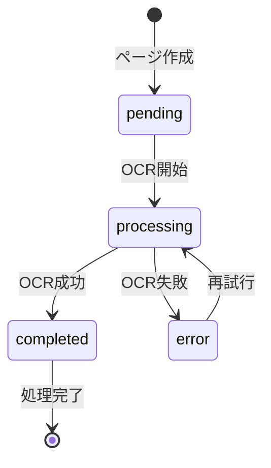
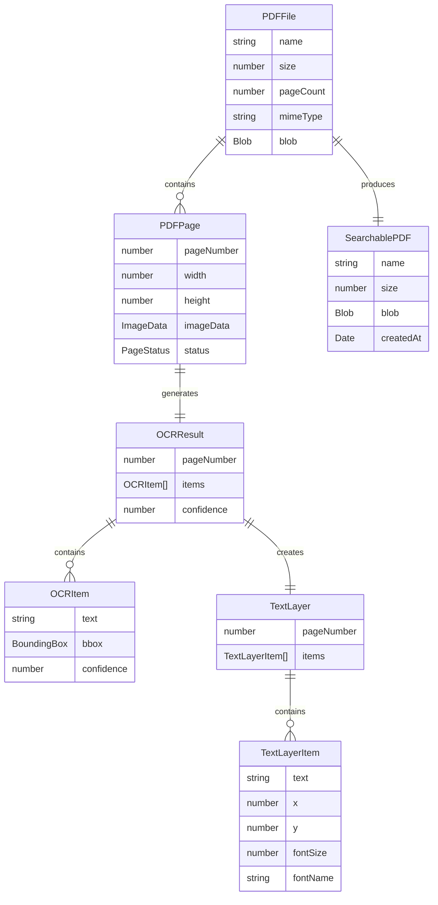
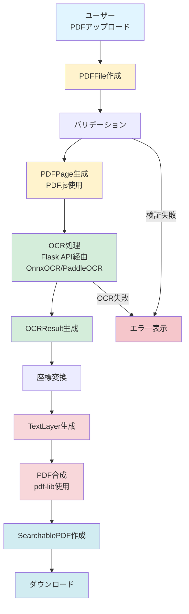
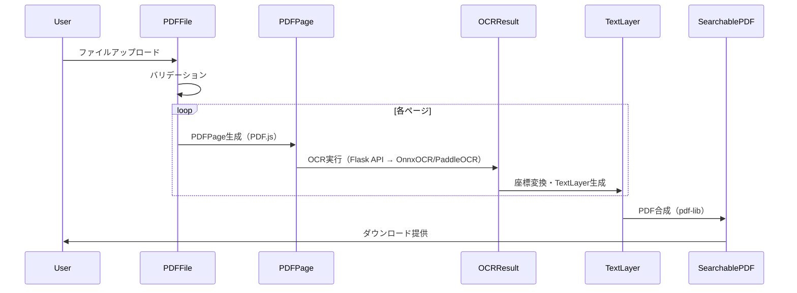
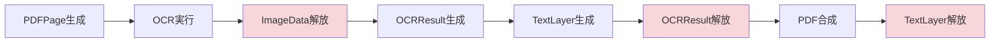

# データモデル設計

**機能**: OCR検索可能PDF変換Webアプリ  
**作成日**: 2026-1-15  
**基準**: [spec.md](https://github.com/J1921604/OCR-PDF-Converter/blob/main/specs/001-OCR-PDF-Converter/spec.md), [requirements.md](https://github.com/J1921604/OCR-PDF-Converter/blob/main/specs/001-OCR-PDF-Converter/requirements.md), [research.md](https://github.com/J1921604/OCR-PDF-Converter/blob/main/specs/001-OCR-PDF-Converter/research.md)

---

## 概要

このドキュメントは、OCR検索可能PDF変換アプリケーションのデータモデルを定義します。全ての処理はブラウザ内で完結するため、データベースやバックエンドAPIは存在せず、全てのエンティティはJavaScript/TypeScriptのメモリ上で管理されます。

---

## エンティティ定義

### 1. PDFFile

**説明**: ユーザーがアップロードする入力PDFファイルを表現

**属性**:

| 属性名 | 型 | 必須 | 説明 |
|--------|-----|------|------|
| `name` | `string` | ✅ | ファイル名（例: "document.pdf"） |
| `size` | `number` | ✅ | ファイルサイズ（バイト単位） |
| `pageCount` | `number` | ✅ | PDFのページ数 |
| `mimeType` | `string` | ✅ | MIMEタイプ（必ず "application/pdf"） |
| `blob` | `Blob` | ✅ | ファイルの実データ |

**検証ルール**:
- `size <= 10 * 1024 * 1024` (10MB以下)
- `mimeType === "application/pdf"`
- `pageCount >= 1`

**TypeScript型定義**:
```typescript
interface PDFFile {
  name: string;
  size: number;
  pageCount: number;
  mimeType: 'application/pdf';
  blob: Blob;
}
```

**ライフサイクル**:
1. ユーザーがファイルをアップロード
2. バリデーション実行（サイズ、MIME type、ページ数）
3. 各ページをPDFPageエンティティに分割
4. 処理完了後、メモリ解放

---

### 2. PDFPage

**説明**: PDFファイルを構成する個々のページを表現

**属性**:

| 属性名 | 型 | 必須 | 説明 |
|--------|-----|------|------|
| `pageNumber` | `number` | ✅ | ページ番号（1始まり） |
| `width` | `number` | ✅ | ページ幅（ピクセル、300dpi基準） |
| `height` | `number` | ✅ | ページ高さ（ピクセル、300dpi基準） |
| `imageData` | `ImageData` | ✅ | レンダリングされた画像データ |
| `status` | `PageStatus` | ✅ | 処理状態（後述） |

**PageStatus型**:
```typescript
type PageStatus = 
  | 'pending'      // 未処理
  | 'processing'   // OCR処理中
  | 'completed'    // OCR完了
  | 'error';       // エラー発生
```

**状態遷移図**:


**TypeScript型定義**:
```typescript
interface PDFPage {
  pageNumber: number;
  width: number;
  height: number;
  imageData: ImageData;
  status: PageStatus;
}
```

**ライフサイクル**:
1. PDFFileから生成（PDF.jsで画像化）
2. OCR処理キューに追加（status: pending）
3. OCR実行（status: processing）
4. OCRResult生成（status: completed）
5. メモリ解放（imageDataをnullに設定）

---

### 3. OCRResult

**説明**: OCRエンジンが出力するテキストと位置情報を表現

**属性**:

| 属性名 | 型 | 必須 | 説明 |
|--------|-----|------|------|
| `pageNumber` | `number` | ✅ | 対象ページ番号 |
| `items` | `OCRItem[]` | ✅ | OCR結果アイテムのリスト |
| `confidence` | `number` | ✅ | 全体の信頼度スコア（0.0-1.0） |

**TypeScript型定義**:
```typescript
interface OCRResult {
  pageNumber: number;
  items: OCRItem[];
  confidence: number;
}
```

**関連**:
- 1つの`PDFPage`に対して1つの`OCRResult`が生成される

**信頼度計算**:
```javascript
// 全アイテムの平均信頼度
const confidence = items.reduce((sum, item) => sum + item.confidence, 0) / items.length;
```

---

### 4. OCRItem

**説明**: 個々の認識されたテキスト要素（単語または文字列）

**属性**:

| 属性名 | 型 | 必須 | 説明 |
|--------|-----|------|------|
| `text` | `string` | ✅ | 認識されたテキスト |
| `bbox` | `BoundingBox` | ✅ | バウンディングボックス（画像座標系） |
| `confidence` | `number` | ✅ | 信頼度スコア（0.0-1.0） |

**BoundingBox型**:
```typescript
interface BoundingBox {
  x1: number;  // 左上X座標
  y1: number;  // 左上Y座標
  x2: number;  // 右下X座標
  y2: number;  // 右下Y座標
}
```

**TypeScript型定義**:
```typescript
interface OCRItem {
  text: string;
  bbox: BoundingBox;
  confidence: number;
}
```

**例**:
```javascript
{
  text: "こんにちは",
  bbox: { x1: 120, y1: 350, x2: 280, y2: 390 },
  confidence: 0.95
}
```

---

### 5. TextLayer

**説明**: PDFに埋め込む透明テキストレイヤーを表現

**属性**:

| 属性名 | 型 | 必須 | 説明 |
|--------|-----|------|------|
| `pageNumber` | `number` | ✅ | 対象ページ番号 |
| `items` | `TextLayerItem[]` | ✅ | テキストアイテムのリスト |

**TypeScript型定義**:
```typescript
interface TextLayer {
  pageNumber: number;
  items: TextLayerItem[];
}
```

**関連**:
- `OCRResult`から生成される
- 座標変換（画像座標 → PDF座標）を経て生成

**変換フロー**:


---

### 6. TextLayerItem

**説明**: テキストレイヤーの個々のテキスト要素

**属性**:

| 属性名 | 型 | 必須 | 説明 |
|--------|-----|------|------|
| `text` | `string` | ✅ | テキスト内容 |
| `x` | `number` | ✅ | X座標（PDF座標系） |
| `y` | `number` | ✅ | Y座標（PDF座標系） |
| `fontSize` | `number` | ✅ | フォントサイズ（ポイント） |
| `fontName` | `string` | ✅ | フォント名（例: "HeiseiKakuGo-W5"） |

**TypeScript型定義**:
```typescript
interface TextLayerItem {
  text: string;
  x: number;
  y: number;
  fontSize: number;
  fontName: string;
}
```

**座標変換ルール**:
```javascript
// 画像座標（上が0） → PDF座標（下が0）
function convertToPDFCoords(imageBbox, imageHeight, pdfHeight) {
  const scaleY = pdfHeight / imageHeight;
  
  return {
    x: imageBbox.x1,
    y: pdfHeight - (imageBbox.y2 * scaleY),  // Y軸反転
    fontSize: (imageBbox.y2 - imageBbox.y1) * scaleY,
  };
}
```

**例**:
```javascript
{
  text: "こんにちは",
  x: 120,
  y: 650,  // PDF座標系（下が0）
  fontSize: 12,
  fontName: "HeiseiKakuGo-W5"
}
```

---

### 7. SearchablePDF

**説明**: 最終的な検索可能PDFファイルを表現

**属性**:

| 属性名 | 型 | 必須 | 説明 |
|--------|-----|------|------|
| `name` | `string` | ✅ | ファイル名（元のファイル名 + "_searchable.pdf"） |
| `size` | `number` | ✅ | ファイルサイズ（バイト） |
| `blob` | `Blob` | ✅ | PDFデータ |
| `createdAt` | `Date` | ✅ | 生成日時 |

**TypeScript型定義**:
```typescript
interface SearchablePDF {
  name: string;
  size: number;
  blob: Blob;
  createdAt: Date;
}
```

**命名ルール**:
```javascript
// 元のファイル名: "document.pdf"
// 出力ファイル名: "document_searchable.pdf"
const outputName = originalName.replace('.pdf', '_searchable.pdf');
```

**ライフサイクル**:
1. 全ページのTextLayerを生成
2. pdf-libで元のPDFにテキストレイヤーをオーバーレイ
3. PDF生成（Blob作成）
4. ユーザーにダウンロード提供
5. メモリ解放

---

## エンティティ関係図（ER図）



---

## データフロー図

### 全体の処理フロー



### 詳細なデータ変換フロー



---

## メモリ管理戦略

### メモリ使用量の見積もり

| エンティティ | 1ページあたりのサイズ | 10ページでの合計 |
|-------------|---------------------|----------------|
| PDFPage (ImageData) | 約50MB (A4, 300dpi) | 500MB |
| OCRResult | 約1MB（テキスト+座標） | 10MB |
| TextLayer | 約500KB | 5MB |
| Backend OCR Process | サーバー側メモリ | N/A (クライアント負荷なし) |
| **合計** | - | **約1.1GB** ✅ |

**目標**: 2GB以内 → ✅達成可能

### メモリ解放タイミング



**解放ルール**:
1. **PDFPage.imageData**: OCR処理完了後、即座にnullに設定
2. **OCRResult**: TextLayer生成後、即座に破棄
3. **TextLayer**: PDF合成完了後、即座に破棄
4. **Backend OCR**: サーバー側でプロセス完了後、自動的にリソース解放

---

## バリデーションルール一覧

### PDFFileバリデーション

```javascript
function validatePDFFile(file) {
  const errors = [];
  
  // MIMEタイプチェック
  if (file.mimeType !== 'application/pdf') {
    errors.push('PDFファイルのみアップロード可能です');
  }
  
  // ファイルサイズチェック
  const maxSize = 10 * 1024 * 1024;  // 10MB
  if (file.size > maxSize) {
    errors.push('ファイルサイズは10MB以下にしてください');
  }
  
  // ページ数チェック
  if (file.pageCount < 1) {
    errors.push('PDFにページが含まれていません');
  }
  
  return errors.length === 0 ? null : errors;
}
```

### OCRResultバリデーション

```javascript
function validateOCRResult(ocrResult) {
  const errors = [];
  
  // 信頼度チェック
  if (ocrResult.confidence < 0.5) {
    errors.push(`ページ${ocrResult.pageNumber}のOCR信頼度が低すぎます（${Math.round(ocrResult.confidence * 100)}%）`);
  }
  
  // アイテム数チェック
  if (ocrResult.items.length === 0) {
    errors.push(`ページ${ocrResult.pageNumber}にテキストが認識されませんでした`);
  }
  
  return errors.length === 0 ? null : errors;
}
```

---

## 成功基準（Success Criteria）対応

### SC-001: 1ページPDF処理時間 30秒以内

**データモデルレベルでの対応**:
- PDFPageのImageDataを300dpiに制限（処理速度とのバランス）
- OCRResultを逐次生成（並列化で高速化）

### SC-002: OCR精度 90%以上

**データモデルレベルでの対応**:
- OCRItem.confidenceで個別精度を記録
- OCRResult.confidenceで全体精度を追跡
- 低信頼度（< 0.5）の場合は警告表示

### SC-003: メモリ使用量 2GB以下

**データモデルレベルでの対応**:
- 処理済みエンティティの即座解放
- 大きなBlob/ImageDataの参照を早期に破棄

---

## 次のステップ

1. ✅ **data-model.md作成完了**
2. ⏳ **quickstart.md作成**: 開発環境セットアップ手順
3. ⏳ **エージェントコンテキスト更新**: GitHub Copilot用の設定追加

---

**作成日**: 2026-01-10  
**ステータス**: 完了 ✅  
**次のアクション**: quickstart.md作成
