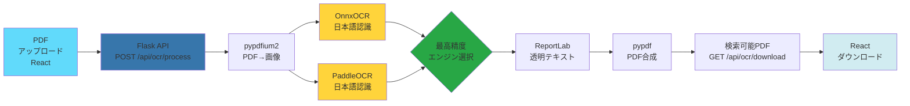
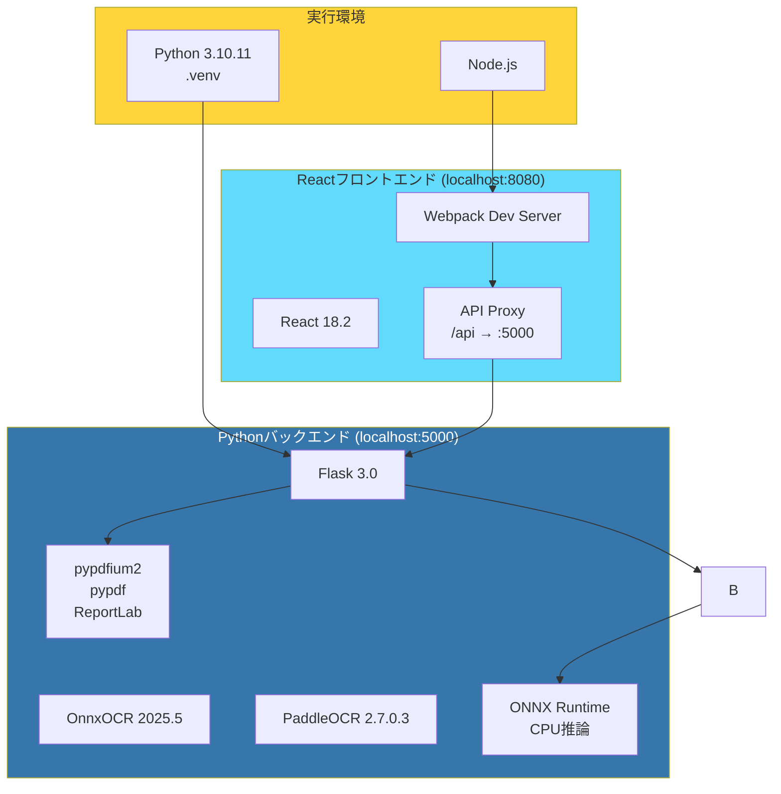
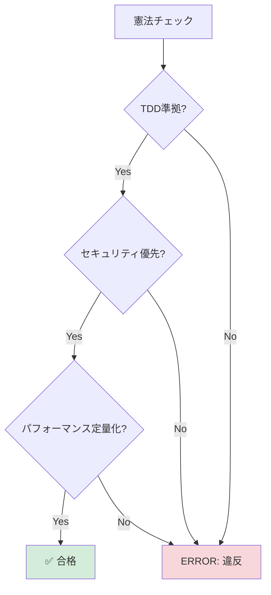
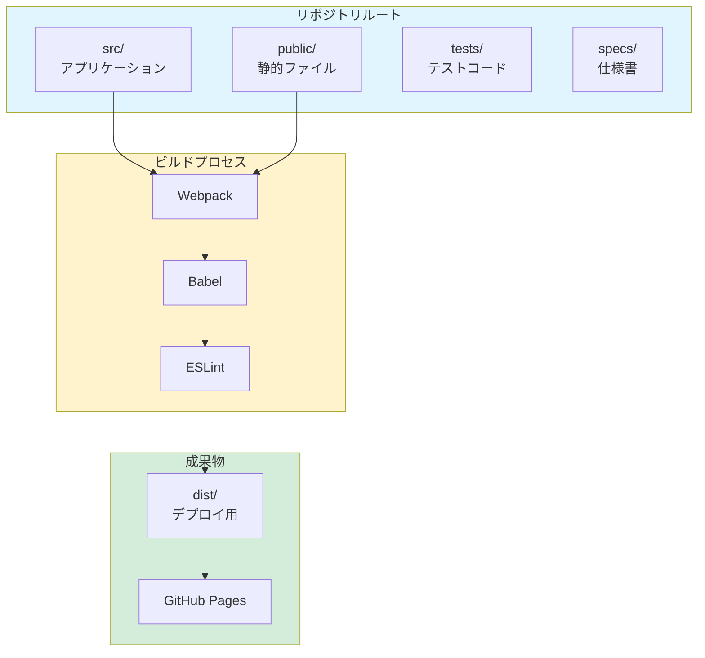
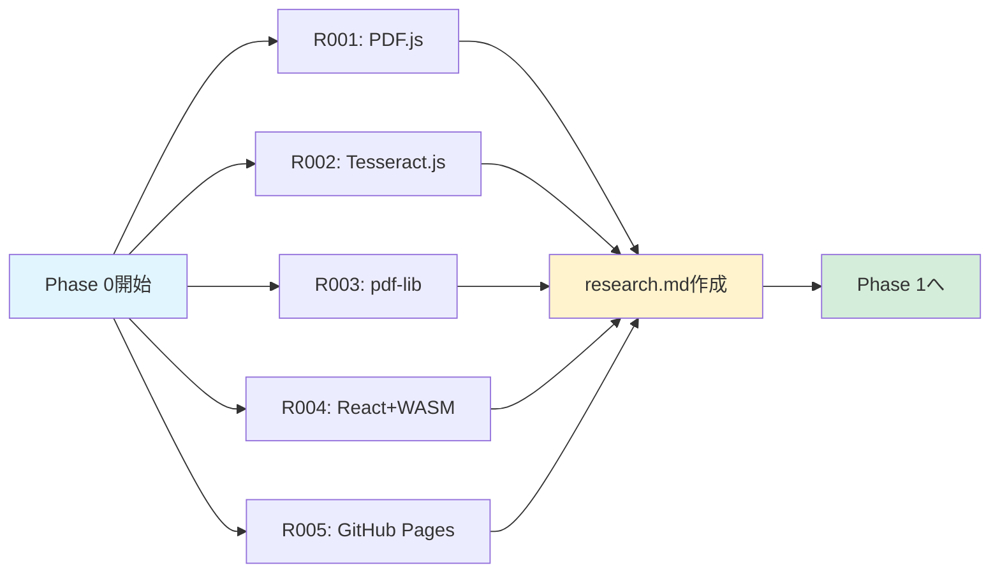
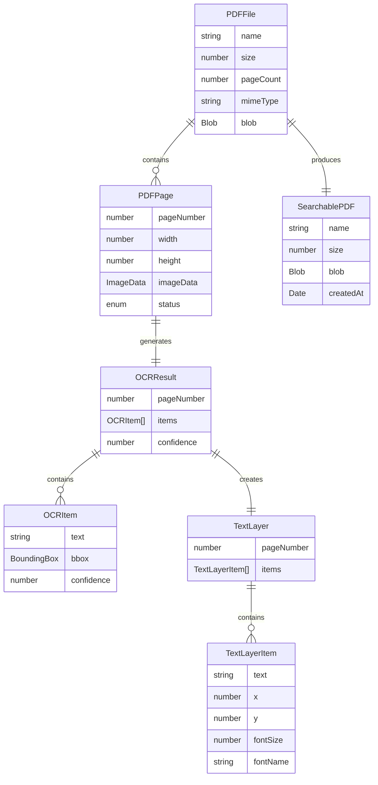
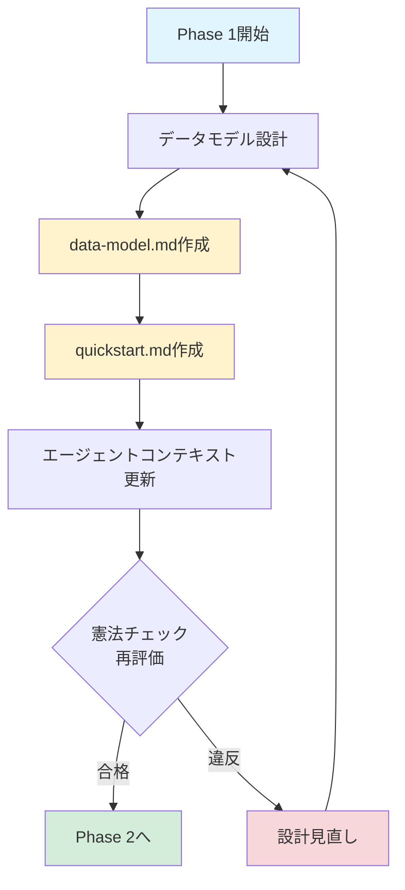

# 実装計画: OCR検索可能PDF変換Webアプリ

**ブランチ**: `001-OCR-PDF-Converter` | **日付**: 2026-01-15 | **仕様**: [spec.md](https://github.com/J1921604/OCR-PDF-Converter/blob/main/specs/001-OCR-PDF-Converter/spec.md)  
**入力**: 機能仕様書 `specs/001-OCR-PDF-Converter/spec.md` および技術要件書 `requirements.md`

## 概要

スキャンしたPDFファイルをPythonバックエンド（複数OCRエンジン並列処理）で高精度OCR処理し、検索可能なテキストレイヤーを追加するWebアプリケーション。Reactフロントエンド + Flask APIサーバー構成。

**主要要件**:
- PDFアップロード → 複数OCRエンジン並列処理（OnnxOCR、PaddleOCR） → 最高精度結果を採用 → 検索可能PDF生成
- チェックボックスUIで複数エンジン選択可能
- 各エンジンの精度統計表示
- 複数ページPDFのバッチ処理（進捗表示付き）
- Python 3.10.11 + 仮想環境(.venv)での実行

**技術アプローチ**:
- pypdfium2でPDF→画像変換（バックエンド）
- OnnxOCR 2025.5（ONNX Runtime CPU推論）で高速OCR処理
- PaddleOCR 2.7.0.3（日本語特化モデル）で高精度OCR処理
- 各ページで全選択エンジンを並列実行し、平均信頼度が最も高いエンジンの結果を採用
- ReportLabで透明テキストレイヤー生成
- pypdfでPDF合成
- Reactでユーザーインターフェース構築



## 技術コンテキスト

**バックエンド**: Python 3.10.11 (仮想環境 .venv)  
**フロントエンド**: JavaScript (ES6+), React 18.2  
**主要依存関係（Python）**: 
- OnnxOCR 2025.5 (高速CPU推論OCRエンジン)
- PaddleOCR 2.7.0.3 (高精度OCRエンジン、日本語特化モデル)
- pypdfium2 4.30 (PDFレンダリング)
- pypdf 5.1 (PDF操作)
- ReportLab 4.2 (テキストレイヤー生成)
- Flask 3.0 (REST APIサーバー)
- ONNX Runtime 1.23 (推論エンジン)

**主要依存関係（JavaScript）**: 
- React 18.2 (UIフレームワーク)
- Webpack 5.104 (モジュールバンドラー)

**ストレージ**: 一時ファイル（tempfile.gettempdir()）、処理完了後自動削除  
**テスト**: pytest (バックエンド単体テスト), Cypress (E2Eテスト)  
**ターゲットプラットフォーム**: 
- Chrome 100+
- Firefox 100+
- Edge 100+
- Safari 15+

**プロジェクトタイプ**: ハイブリッド（Pythonバックエンド + Reactフロントエンド）  
**パフォーマンス目標**:
- 1ページPDF (A4, 300dpi) OCR処理: 5秒以内 (P95、複数エンジン並列実行)
- 10ページPDF OCR処理: 50秒以内 (P95)
- メモリ使用量: Python 1GB、React 256MB（ピーク時）
- 各エンジンの精度統計をリアルタイム表示

**制約**:
- ファイルサイズ上限: 50MB
- Python 3.10.11必須
- ONNX Runtime対応CPU必須
- ローカル実行（localhost:5000 + localhost:8080）

**規模/範囲**:
- 対象ユーザー: 個人ユーザー、小規模チーム
- 想定利用: ローカル環境での個人利用
- 機能数: 3つのユーザーストーリー（P1: MVP、P2/P3: 拡張機能）



## 憲法チェック

*ゲート: Phase 0リサーチ前に合格必須。Phase 1設計後に再チェック。*

### ✅ テスト駆動開発（必須・非交渉）

- **状態**: ✅ 準拠
- **根拠**: 
  - 全ユーザーストーリーに受入シナリオが定義されている（spec.md）
  - テストフレームワーク（Jest, React Testing Library, Cypress）を採用
  - テストカバレッジ目標: 80%以上

### ✅ セキュリティ優先

- **状態**: ✅ 準拠
- **根拠**:
  - FR-009: アップロードしたPDFをサーバーに送信しない（完全クライアントサイド）
  - Content Security Policy (CSP) を実装
  - 機密データの外部送信を禁止
  - 処理後のメモリ解放を実装

### ✅ パフォーマンス定量化

- **状態**: ✅ 準拠
- **根拠**:
  - SC-001: 1ページPDF処理 30秒以内
  - SC-002: OCR精度 90%以上
  - SC-003: メモリ使用量 2GB以下
  - Performance APIで計測

### 違反なし

複雑性の導入や憲法違反は存在しません。



## プロジェクト構造

### ドキュメント（この機能）

```text
specs/001-OCR-PDF-Converter/
├── spec.md              # 機能仕様書
├── requirements.md      # 技術要件書
├── plan.md              # このファイル（実装計画）
├── research.md          # Phase 0 出力（技術調査結果）
├── data-model.md        # Phase 1 出力（データモデル定義）
├── quickstart.md        # Phase 1 出力（開発環境セットアップ手順）
├── contracts/           # Phase 1 出力（API契約定義）※該当なし
├── checklists/          # 品質チェックリスト
│   └── requirements.md  # 仕様品質チェックリスト（✅合格済み）
└── tasks.md             # Phase 2 出力（/speckit.tasks コマンドで生成）
```

### ソースコード（リポジトリルート）

```text
OCR-PDF-Converter/
├── src/                          # アプリケーションソースコード
│   ├── components/               # Reactコンポーネント
│   │   ├── FileUploader.jsx     # PDFアップロードコンポーネント
│   │   ├── OCRProgress.jsx      # 進捗バー表示
│   │   ├── PreviewPane.jsx      # OCR結果プレビュー
│   │   └── DownloadButton.jsx   # ダウンロードボタン
│   ├── services/                 # ビジネスロジック
│   │   ├── pdfProcessor.js      # PDF.js ラッパー
│   │   ├── ocrEngine.js         # Tesseract.js ラッパー
│   │   └── pdfGenerator.js      # pdf-lib ラッパー
│   ├── utils/                    # ユーティリティ関数
│   │   ├── fileValidator.js     # ファイル検証
│   │   ├── coordinateConverter.js # 座標変換
│   │   └── errorHandler.js      # エラーハンドリング
│   ├── hooks/                    # カスタムReact Hooks
│   │   ├── useOCR.js            # OCR処理Hook
│   │   └── useFileUpload.js     # ファイルアップロードHook
│   ├── App.jsx                   # ルートコンポーネント
│   ├── index.jsx                 # エントリーポイント
│   └── styles/                   # スタイルシート
│       └── main.css
├── public/                       # 静的ファイル
│   ├── index.html               # HTMLテンプレート
│   ├── manifest.json            # PWAマニフェスト
│   └── assets/
│       └── wasm/                # WebAssemblyファイル
│           └── jpn.traineddata  # 日本語OCRモデル
├── tests/                        # テストコード
│   ├── unit/                    # 単体テスト
│   │   ├── pdfProcessor.test.js
│   │   ├── ocrEngine.test.js
│   │   └── pdfGenerator.test.js
│   ├── integration/             # 統合テスト
│   │   └── ocrWorkflow.test.js
│   └── e2e/                     # E2Eテスト
│       └── uploadToDownload.cy.js
├── .github/                      # GitHub設定
│   ├── workflows/
│   │   └── deploy.yml           # GitHub Actions CI/CD
│   ├── prompts/                 # 開発ガイド
│   └── agents/                  # エージェント設定
├── .specify/                     # プロジェクト管理
│   ├── memory/
│   │   └── constitution.md      # プロジェクト憲法
│   ├── templates/               # ドキュメントテンプレート
│   └── scripts/                 # 管理スクリプト
├── specs/                        # 仕様ドキュメント（上記参照）
├── package.json                  # 依存関係定義
├── package-lock.json             # バージョンロック
├── webpack.config.js             # Webpackビルド設定
├── .eslintrc.json               # ESLint設定
├── .prettierrc.json             # Prettier設定
├── jest.config.js               # Jest設定
├── cypress.config.js            # Cypress設定
├── README.md                     # プロジェクト説明
├── start-dev.ps1                # ワンコマンド起動スクリプト
└── LICENSE                       # MITライセンス
```

**構造決定**: 単一プロジェクト構造を採用。フロントエンドのみのアプリケーションであり、バックエンドは不要。GitHub Pagesで静的ホスティングを行うため、`src/`配下に全てのアプリケーションロジックを配置し、`public/`に静的アセットを配置する。



## 複雑性追跡

> **憲法チェックで違反がある場合のみ記入**

該当なし。本プロジェクトは憲法に完全準拠しています。

---

## Phase 0: アウトライン & リサーチ

### 目的

技術コンテキストの「NEEDS CLARIFICATION」を解決し、依存ライブラリのベストプラクティスを調査する。

### リサーチタスク

#### R001: PDF.jsの最適な使用方法

**目的**: PDFページを300dpiで画像化する最適な方法を特定

**調査内容**:
- PDF.js APIの使用方法（getPage, render）
- スケール計算（72dpi → 300dpi）
- Canvas APIとの連携
- メモリ効率的なページ処理

**成果物**: `research.md` セクション「PDF.js Usage」

#### R002: Tesseract.jsのパフォーマンスチューニング

**目的**: OCR処理速度を5秒以内に抑える方法を調査

**調査内容**:
- Workerスレッドの使用
- 日本語モデル（jpn.traineddata）の最適化
- 画像前処理（グレースケール化、二値化）の効果
- バッチ処理の並列化

**成果物**: `research.md` セクション「Tesseract.js Performance」

#### R003: pdf-libでの透明テキストレイヤー生成

**目的**: OCR結果をPDFに正しく埋め込む方法を確立

**調査内容**:
- 座標系の変換（画像座標 → PDF座標）
- フォントサイズの計算
- 透明テキストの設定（setFillAlpha）
- 日本語フォントの登録

**成果物**: `research.md` セクション「pdf-lib Text Layer」

#### R004: React+WebAssemblyの統合パターン

**目的**: ReactコンポーネントでWebAssemblyを効率的に使用する方法

**調査内容**:
- useEffectでのWASM初期化
- Workerスレッドとの通信
- 非同期処理の状態管理
- エラーハンドリング

**成果物**: `research.md` セクション「React+WASM Integration」

#### R005: GitHub Pagesデプロイベストプラクティス

**目的**: SPAをGitHub Pagesで正しくデプロイする方法

**調査内容**:
- 404.htmlトリック（クライアントサイドルーティング対応）
- Service Workerのキャッシュ戦略
- ビルド成果物の最適化
- GitHub Actionsワークフロー

**成果物**: `research.md` セクション「GitHub Pages Deployment」

### 決定事項（リサーチ後）

リサーチ完了後、以下の決定を記録：
- 採用するライブラリバージョン
- パフォーマンスチューニング手法
- アーキテクチャパターン
- デプロイ戦略



---

## Phase 1: 設計 & 契約

### 前提条件

- Phase 0の`research.md`が完成していること
- 全ての「NEEDS CLARIFICATION」が解決されていること

### データモデル設計

#### エンティティ抽出

`data-model.md`に以下のエンティティを定義：

##### 1. PDFFile

**説明**: ユーザーがアップロードする入力PDFファイル

**属性**:
- `name: string` - ファイル名
- `size: number` - ファイルサイズ（バイト）
- `pageCount: number` - ページ数
- `mimeType: string` - MIME type ("application/pdf")
- `blob: Blob` - ファイルデータ

**検証ルール**:
- `size <= 10 * 1024 * 1024` (10MB以下)
- `mimeType === "application/pdf"`

##### 2. PDFPage

**説明**: PDFファイルを構成する個々のページ

**属性**:
- `pageNumber: number` - ページ番号（1始まり）
- `width: number` - ページ幅（ピクセル）
- `height: number` - ページ高さ（ピクセル）
- `imageData: ImageData` - レンダリングされた画像データ（300dpi）
- `status: "pending" | "processing" | "completed" | "error"` - 処理状態

**状態遷移**:
```
pending → processing → completed
                    ↘ error
```

##### 3. OCRResult

**説明**: OCRエンジンが出力するテキストと位置情報

**属性**:
- `pageNumber: number` - 対象ページ番号
- `items: OCRItem[]` - OCR結果アイテムのリスト
- `confidence: number` - 全体の信頼度スコア（0-1）

**関連**:
- 1つの`PDFPage`に対して1つの`OCRResult`

##### 4. OCRItem

**説明**: 個々の認識されたテキスト要素

**属性**:
- `text: string` - 認識されたテキスト
- `bbox: BoundingBox` - バウンディングボックス（画像座標）
- `confidence: number` - 信頼度スコア（0-1）

**BoundingBox型**:
```typescript
type BoundingBox = {
  x1: number;  // 左上X座標
  y1: number;  // 左上Y座標
  x2: number;  // 右下X座標
  y2: number;  // 右下Y座標
};
```

##### 5. TextLayer

**説明**: PDFに埋め込む透明テキストレイヤー

**属性**:
- `pageNumber: number` - 対象ページ番号
- `items: TextLayerItem[]` - テキストアイテムのリスト

**関連**:
- `OCRResult`から生成される

##### 6. TextLayerItem

**説明**: テキストレイヤーの個々のテキスト要素

**属性**:
- `text: string` - テキスト内容
- `x: number` - X座標（PDF座標系）
- `y: number` - Y座標（PDF座標系）
- `fontSize: number` - フォントサイズ
- `fontName: string` - フォント名（例: "HeiseiKakuGo-W5"）

**座標変換ルール**:
- 画像座標（上が0） → PDF座標（下が0）
- `pdfY = pageHeight - imageY`

##### 7. SearchablePDF

**説明**: 最終的な検索可能PDFファイル

**属性**:
- `name: string` - ファイル名（元のファイル名 + "_searchable.pdf"）
- `size: number` - ファイルサイズ
- `blob: Blob` - PDFデータ
- `createdAt: Date` - 生成日時



### API契約定義（該当なし）

本プロジェクトは完全クライアントサイドアプリケーションであり、バックエンドAPIは存在しないため、`contracts/`ディレクトリは作成しません。

### クイックスタート生成

`quickstart.md`に以下の内容を記載：

#### 開発環境セットアップ

1. **前提条件**
   - Node.js 18以上
   - npm または yarn

2. **インストール手順**
   ```bash
   git clone https://github.com/J1921604/OCR-PDF-Converter.git
   cd OCR-PDF-Converter
   npm install
   ```

3. **開発サーバー起動**
   ```bash
   npm start
   # または
   .\start-dev.ps1  # ワンコマンド起動（Windows）
   ```

4. **ブラウザでアクセス**
   - `http://localhost:3000`

#### テスト実行

```bash
# 単体テスト
npm test

# E2Eテスト
npm run e2e

# カバレッジ確認
npm run test:coverage
```

#### ビルド

```bash
# 本番ビルド
npm run build

# ビルド成果物は dist/ に生成される
```

### エージェントコンテキスト更新

現在使用しているエージェント（GitHub Copilot）のコンテキストファイルを更新します。

**更新内容**:
- 技術スタック: JavaScript, React, PDF.js, Tesseract.js, pdf-lib
- プロジェクトタイプ: Webアプリケーション（単一プロジェクト）
- 主要パターン: React Hooks, カスタムフック、Service層

### 憲法チェック再評価（Phase 1完了後）

Phase 1完了後、以下を再確認：
- ✅ データモデルが仕様と一致している
- ✅ テストカバレッジが計画されている
- ✅ セキュリティ要件（クライアントサイド処理）が設計に反映されている
- ✅ パフォーマンス目標が達成可能である



---

## Phase 2: タスク分解（/speckit.tasks コマンドで実行）

Phase 2は、`/speckit.tasks`コマンドで実行されます。このコマンドは、上記のPhase 0とPhase 1の成果物（`research.md`, `data-model.md`, `quickstart.md`）を基に、詳細なタスクリスト（`tasks.md`）を生成します。

### タスク生成の方針

1. **ユーザーストーリー単位**で分割
   - P1: PDFアップロードとOCR変換（MVP）
   - P2: 複数ページPDFのバッチ処理
   - P3: OCR結果プレビューと編集

2. **テストファースト**
   - 各ストーリーの実装前にテストを作成
   - テストが失敗することを確認してから実装

3. **並列化可能なタスク**を`[P]`マークで識別

4. **依存関係**を明示し、順序を守る

### タスクリストの構造（予定）

```text
Phase 1: セットアップ
- プロジェクト初期化
- 依存パッケージインストール
- Webpack/Babel設定

Phase 2: 基盤構築（ブロッキング）
- PDFProcessor実装（PDF.js ラッパー）
- OCREngine実装（Tesseract.js ラッパー）
- PDFGenerator実装（pdf-lib ラッパー）

Phase 3: ユーザーストーリー1（P1）
- テスト作成（contract, integration）
- コンポーネント実装（FileUploader, OCRProgress, DownloadButton）
- 統合と検証

Phase 4: ユーザーストーリー2（P2）
- 複数ページ対応テスト作成
- バッチ処理実装
- 進捗表示実装

Phase 5: ユーザーストーリー3（P3）
- プレビュー機能テスト作成
- PreviewPaneコンポーネント実装
- 編集機能実装

Phase 6: 仕上げ
- ドキュメント更新
- パフォーマンスチューニング
- E2Eテスト実行
```

---

## 停止と報告

**Phase 2計画完了**: 実装計画が完成しました。

### 次のステップ

1. **Phase 0実行**: `/speckit.plan`コマンド内で`research.md`を生成（リサーチタスクR001-R005を実行）
2. **Phase 1実行**: `/speckit.plan`コマンド内で`data-model.md`, `quickstart.md`を生成
3. **Phase 2実行**: `/speckit.tasks`コマンドで`tasks.md`を生成
4. **実装開始**: `tasks.md`に従って開発を進める

### 生成されたアーティファクト

- ✅ `plan.md`: この実装計画ドキュメント
- ⏳ `research.md`: Phase 0で生成予定
- ⏳ `data-model.md`: Phase 1で生成予定
- ⏳ `quickstart.md`: Phase 1で生成予定
- ⏳ `tasks.md`: `/speckit.tasks`コマンドで生成予定

### ブランチ情報

- **仕様ブランチ**: `001-OCR-PDF-Converter`
- **実装ブランチ**: `feature/impl-001-OCR-PDF-Converter`（現在のブランチ）


---

**作成日**: 2026-01-10  
**ステータス**: Phase 2計画完了  
**次のアクション**: Phase 0リサーチ実行（research.md生成）
