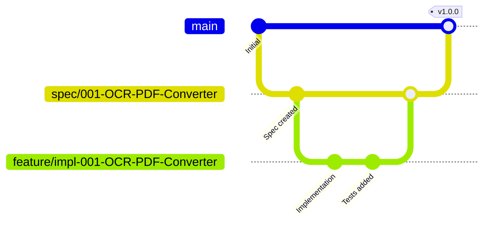

# クイックスタートガイド

**プロジェクト**: OCR検索可能PDF変換Webアプリ  
**対象**: 開発者向け環境セットアップ手順  
**所要時間**: 約10分

---

## 🚀 ワンコマンド起動（推奨）

Windowsユーザーは、以下のコマンドで開発環境を自動起動できます：

```powershell
.\start-dev.ps1
```

このスクリプトは以下を自動実行します：
1. Node.jsバージョンチェック（18以上必須）
2. 依存パッケージのインストール（`npm install`）
3. 開発サーバーの起動（バックグラウンド実行）
4. ブラウザで`http://localhost:3000`を自動起動
5. PowerShellウィンドウの自動クローズ

**注意**: 初回実行時は依存パッケージのインストールに約3-5分かかります。

---

## 📋 前提条件

### 必須ソフトウェア

| ソフトウェア | バージョン | インストール確認コマンド |
|-------------|----------|----------------------|
| Node.js | 18以上 | `node -v` |
| npm | 9以上 | `npm -v` |
| Git | 2.30以上 | `git --version` |

### 推奨環境

- **OS**: Windows 10/11, macOS 12+, Linux (Ubuntu 20.04+)
- **メモリ**: 8GB以上（OCR処理のため）
- **ストレージ**: 1GB以上の空き容量
- **ブラウザ**: Chrome 100+, Firefox 100+, Edge 100+, Safari 15+

### Node.jsインストール（未インストールの場合）

**Windows/macOS**:
1. [Node.js公式サイト](https://nodejs.org/)からLTS版をダウンロード
2. インストーラーを実行
3. ターミナル/PowerShellを再起動
4. `node -v`で確認

**Linux (Ubuntu/Debian)**:
```bash
curl -fsSL https://deb.nodesource.com/setup_18.x | sudo -E bash -
sudo apt-get install -y nodejs
```

---

## 🛠️ セットアップ手順（手動）

### Step 1: リポジトリクローン

```bash
git clone https://github.com/J1921604/OCR-PDF-Converter.git
cd OCR-PDF-Converter
```

**または** GitHubからZIPダウンロード:
1. [リポジトリページ](https://github.com/J1921604/OCR-PDF-Converter)にアクセス
2. "Code" → "Download ZIP"
3. ZIPを展開してディレクトリに移動

### Step 2: 依存パッケージインストール

```bash
npm install
```

**インストールされるパッケージ**:
- `react`: 18.2.0
- `react-dom`: 18.2.0
- `pdfjs-dist`: 4.0.379
- `tesseract.js`: 5.1.0
- `pdf-lib`: 1.17.1
- その他開発ツール（Webpack, Babel, ESLint, Jest）

**所要時間**: 約3-5分（ネットワーク速度による）

### Step 3: 開発サーバー起動

```bash
npm start
```

以下のメッセージが表示されます：
```
Compiled successfully!

You can now view OCR-PDF-Converter in the browser.

  Local:            http://localhost:3000
  On Your Network:  http://192.168.1.100:3000

Note that the development build is not optimized.
To create a production build, use npm run build.
```

### Step 4: ブラウザでアクセス

ブラウザで`http://localhost:3000`を開きます。

**正常起動の確認**:
- アプリケーションのタイトルが表示される
- ファイルアップロードボタンが表示される
- コンソールエラーが出ていない

---

## 🧪 テスト実行

### 単体テスト（Unit Tests）

```bash
npm test
```

**実行内容**:
- `src/services/`配下の各サービスのテスト
- `src/utils/`配下のユーティリティ関数のテスト
- カバレッジレポート生成

**カバレッジ目標**: 80%以上

### カバレッジレポート確認

```bash
npm run test:coverage
```

カバレッジレポートは`coverage/lcov-report/index.html`に生成されます。

### 統合テスト（Integration Tests）

```bash
npm run test:integration
```

**実行内容**:
- ファイルアップロード → OCR → ダウンロードまでのフロー
- 複数ページPDFの処理
- エラーハンドリング

### E2Eテスト（End-to-End Tests）

```bash
npm run e2e
```

**実行内容**:
- Cypressを使用した自動ブラウザテスト
- ユーザーストーリーの受入シナリオ検証

**注意**: E2Eテスト実行前に開発サーバーが起動している必要があります。

---

## 🏗️ ビルド

### 開発ビルド

```bash
npm run build:dev
```

**出力先**: `dist/`  
**特徴**: ソースマップ付き、最適化なし

### 本番ビルド

```bash
npm run build
```

**出力先**: `dist/`  
**特徴**:
- コード最小化（Terser）
- Tree Shaking（未使用コード削除）
- Code Splitting（遅延読み込み）
- 圧縮（Gzip/Brotli）

**ビルドサイズ目標**:
- メインバンドル: 500KB以下
- OCRモデル（jpn.traineddata）: 15MB（別ファイル）

---

## 📦 プロジェクト構造

```text
OCR-PDF-Converter/
├── src/                          # アプリケーションソースコード
│   ├── components/               # Reactコンポーネント
│   │   ├── FileUploader.jsx     # PDFアップロード
│   │   ├── OCRProgress.jsx      # 進捗バー
│   │   ├── PreviewPane.jsx      # プレビュー
│   │   └── DownloadButton.jsx   # ダウンロードボタン
│   ├── services/                 # ビジネスロジック
│   │   ├── pdfProcessor.js      # PDF.js ラッパー
│   │   ├── ocrEngine.js         # Tesseract.js ラッパー
│   │   └── pdfGenerator.js      # pdf-lib ラッパー
│   ├── utils/                    # ユーティリティ関数
│   │   ├── fileValidator.js     # ファイル検証
│   │   ├── coordinateConverter.js # 座標変換
│   │   └── errorHandler.js      # エラーハンドリング
│   ├── hooks/                    # カスタムReact Hooks
│   │   ├── useOCR.js            # OCR処理Hook
│   │   └── useFileUpload.js     # ファイルアップロードHook
│   ├── App.jsx                   # ルートコンポーネント
│   ├── index.jsx                 # エントリーポイント
│   └── styles/                   # スタイルシート
│       └── main.css
├── public/                       # 静的ファイル
│   ├── index.html               # HTMLテンプレート
│   ├── manifest.json            # PWAマニフェスト
│   └── assets/
│       ├── wasm/                # WebAssemblyファイル
│       │   └── jpn.traineddata  # 日本語OCRモデル
│       └── fonts/               # 日本語フォント
│           └── HeiseiKakuGo-W5.ttf
├── tests/                        # テストコード
│   ├── unit/                    # 単体テスト
│   ├── integration/             # 統合テスト
│   └── e2e/                     # E2Eテスト
├── package.json                  # 依存関係定義
├── webpack.config.js             # Webpackビルド設定
├── jest.config.js               # Jest設定
├── cypress.config.js            # Cypress設定
├── .eslintrc.json               # ESLint設定
├── .prettierrc.json             # Prettier設定
├── README.md                     # プロジェクト説明
└── start-dev.ps1                # ワンコマンド起動スクリプト
```

---

## 🔧 開発ツール

### コードフォーマット

```bash
# Prettierで全ファイルをフォーマット
npm run format

# フォーマットチェックのみ（CI用）
npm run format:check
```

### コード品質チェック

```bash
# ESLintでコードチェック
npm run lint

# 自動修正
npm run lint:fix
```

### 型チェック（TypeScriptを使用する場合）

```bash
npm run type-check
```

---

## 🐛 デバッグ

### ブラウザDevTools

1. Chrome DevToolsを開く（F12）
2. "Sources"タブでブレークポイントを設定
3. "Console"タブでエラーログを確認

### React DevTools

[React Developer Tools](https://chrome.google.com/webstore/detail/react-developer-tools/fmkadmapgofadopljbjfkapdkoienihi)をインストールすると、コンポーネントツリーとPropsを検査できます。

### パフォーマンス計測

```javascript
// src/utils/performanceMonitor.js を使用
import { measurePerformance } from './utils/performanceMonitor';

measurePerformance('OCR処理', async () => {
  await performOCR(imageData);
});
```

---

## 📚 よくある質問（FAQ）

### Q1: `npm install`が失敗する

**A**: Node.jsバージョンを確認してください。18以上が必須です。

```bash
node -v  # v18.0.0 以上であることを確認
```

古いバージョンの場合は、Node.jsを再インストールしてください。

### Q2: 開発サーバーが起動しない

**A**: ポート3000が既に使用されている可能性があります。

```bash
# ポートを変更して起動
PORT=3001 npm start
```

### Q3: OCR処理が遅い

**A**: 以下を確認してください：
- CPUリソースが十分か（タスクマネージャーで確認）
- ブラウザのWebAssemblyサポートが有効か
- ファイルサイズが10MB以下か

### Q4: 日本語フォントが表示されない

**A**: `public/assets/fonts/HeiseiKakuGo-W5.ttf`が存在するか確認してください。なければ、以下からダウンロード：

```bash
# フォントをダウンロード（Mac/Linuxの場合）
curl -o public/assets/fonts/HeiseiKakuGo-W5.ttf \
  https://github.com/adobe-fonts/source-han-sans/releases/download/2.004R/SourceHanSansJP.zip
```

---

## 🚀 デプロイ（GitHub Pages）

### Step 1: ビルド実行

```bash
npm run build
```

### Step 2: GitHub Pagesにデプロイ

```bash
npm run deploy
```

**または** GitHub Actionsで自動デプロイ（推奨）:

1. リポジトリの"Settings" → "Pages"に移動
2. "Source"を"GitHub Actions"に設定
3. mainブランチにプッシュすると自動デプロイ

デプロイ後、`https://<username>.github.io/OCR-PDF-Converter/`でアクセスできます。

---

## 🤝 コントリビューション

### ブランチ戦略



### 開発フロー

1. **仕様ブランチ作成**: `001-OCR-PDF-Converter`
2. **実装ブランチ作成**: `feature/impl-001-OCR-PDF-Converter`
3. **実装 → テスト → コミット**
4. **実装ブランチ → 仕様ブランチにマージ**
5. **仕様ブランチ → mainブランチにマージ**

### コミットメッセージ規約

`.github/copilot-commit-message-instructions.md`に従ってください：

```text
feat: 新機能追加
fix: バグ修正
docs: ドキュメント更新
test: テスト追加
refactor: リファクタリング
```

---

## 📞 サポート

問題が発生した場合は、以下を確認してください：

1. **ドキュメント**: [README.md](../../README.md)
2. **仕様書**: [spec.md](./spec.md)
3. **技術要件**: [requirements.md](./requirements.md)
4. **実装計画**: [plan.md](./plan.md)

---

**作成日**: 2026-01-10  
**バージョン**: 1.0.0  
**ステータス**: 完了 ✅
