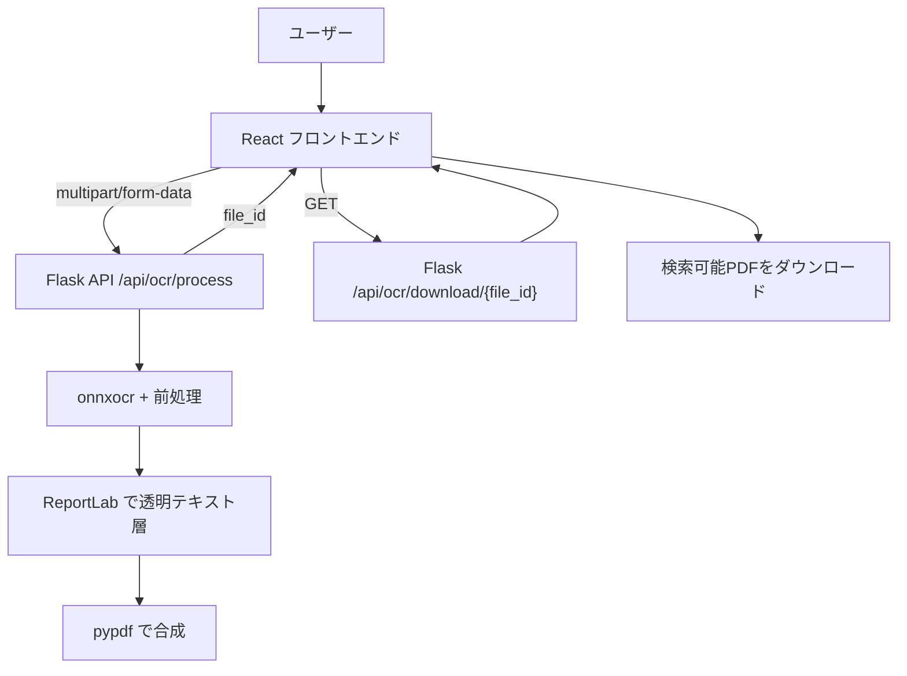
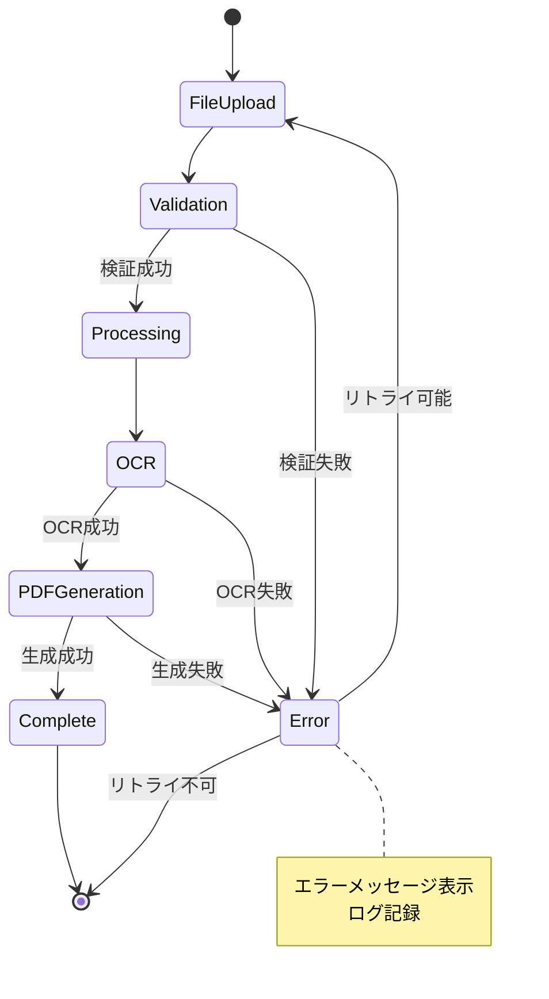

# 技術要件: OCR検索可能PDF変換Webアプリ

**関連ドキュメント**:

- 仕様: https://github.com/J1921604/OCR-PDF-Converter/blob/main/specs/001-OCR-PDF-Converter/spec.md
- 計画: https://github.com/J1921604/OCR-PDF-Converter/blob/main/specs/001-OCR-PDF-Converter/plan.md
- タスク: https://github.com/J1921604/OCR-PDF-Converter/blob/main/specs/001-OCR-PDF-Converter/tasks.md

**作成日**: 2026-1-15  
**バージョン**: 1.0.0

## 概要

本アプリは、**ローカル実行のPythonバックエンド（Flask + onnxocr）**でOCRと検索可能PDF生成を行い、**Reactフロントエンド**はファイル選択・進捗表示・ダウンロードを担います。

GitHub Pages は **フロントエンドの静的ホスティングのみ**に利用できます（Pages単体ではOCR処理は完結しません）。

## アーキテクチャ要件

### ハイブリッド（フロント + ローカルバックエンド）



### APIエンドポイント（現行実装）

- `GET /api/health`（疎通確認）
- `POST /api/ocr/process`（OCR処理開始）
- `GET /api/ocr/download/<file_id>`（生成PDFダウンロード）

対応コード:

- `backend/app.py`
- `backend/main.py`

## セキュリティ・プライバシー要件

- **外部（インターネット）への送信禁止**: ファイルは外部クラウドへアップロードしない。
- **ローカル送信は許容**: 処理のために `localhost` のバックエンドへ送信する（同一PC内）。
- **一時ファイルの扱い**: バックエンドはOSの一時ディレクトリ（`tempfile.gettempdir()`）を使用し、処理後に削除する（`backend/app.py`）。
- **CORS**: フロント⇄バック間の開発用途でCORSを許可（`Flask-CORS`）。

## 技術スタック要件

### フロントエンド（Node）

- React 18（UI）: `src/*`
- Webpack/Babel（ビルド）: `webpack.config.js`, `babel.config.js`
- PDF.js（ページ数取得/レンダリング用途）: `src/services/pdfProcessor.js`

### バックエンド（Python）

Python依存は **`requirements.txt` を唯一の正**とする。

- Flask / Flask-CORS（API）
- onnxocr（OCR）
- opencv-python / numpy（前処理）
- pypdfium2（PDF→画像）
- reportlab（透明テキスト層の描画）
- pypdf（合成）
- Pillow（画像処理補助）

### 開発・テスト

- Jest（ユニットテスト）: `tests/unit/*`
- Cypress（E2E）: `cypress/*`

## 実行環境要件（Windows）

- Node.js 18系
- Python 3.10.11
- Python仮想環境: `.venv`（`py -3.10 -m venv .venv` で作成し、`requirements.txt` からインストール）

## パフォーマンス要件（目標）

- 1ページ（A4相当 / 300dpi相当）: 体感待ち時間が過度にならないこと
- 進捗表示: **停止して見えない状態にしない**（UIは処理中であることが分かること）

## ファイル制限

- **フロント入力制限（現行）**: 10MB（`src/utils/fileValidator.js`）
- **バックエンド受信上限（現行）**: 50MB（`backend/app.py`）

運用上の実効上限は **10MB** とする（上限を上げる場合はフロント/バック/ドキュメントを同時に変更）。

## ブラウザ互換性

- Chrome / Edge / Firefox の最新安定版を対象
- 必須: File API, Fetch API, Blob URL

## GitHub Pages（制約込み）

- Pages は **静的フロントエンドのみ**を配布する。
- Pages（HTTPS）から `http://localhost:5000` を呼ぶことは **mixed content** でブロックされるため、Pages上ではOCR機能は動かない。
- OCRをPages上で動かすには、バックエンドを **HTTPS** で公開し、フロント側の `REACT_APP_API_URL` をそのURLに向ける必要がある。

### GitHub Actions（現行）

デプロイワークフローは `/.github/workflows/pages.yml` を参照する。

## エラーハンドリング

### エラー分類と対応

| エラー種別 | 検出タイミング | ユーザー通知 | リトライ |
|-----------|----------------|-------------|---------|
| ファイル形式エラー | アップロード時 | 「対応形式: PDF, JPEG, PNG, TIFFのみ」 | 不可 |
| ファイルサイズ超過 | アップロード時 | 「ファイルサイズは10MB以下にしてください」 | 不可 |
| PDF破損エラー | PDF解析時 | 「PDFファイルが破損しています」 | 不可 |
| OCR処理タイムアウト | OCR実行中 | 「処理がタイムアウトしました。再試行してください」 | 可 |
| メモリ不足エラー | 処理中 | 「メモリ不足です。ページ数の少ないPDFをお試しください」 | 不可 |
| ブラウザ非対応 | アプリ起動時 | 「お使いのブラウザは非対応です。Chrome/Firefox/Edgeをご利用ください」 | 不可 |



## セキュリティ要件

### Content Security Policy (CSP)

※本プロジェクトは開発時に `http://localhost:5000` のバックエンドへ接続するため、`connect-src 'none'` は要件として不適切。
本番で同一オリジン（リバプロ等）にする場合は `connect-src 'self'` のみでよい。

```html
<meta http-equiv="Content-Security-Policy" content="
  default-src 'self';
  script-src 'self' 'wasm-unsafe-eval';
  style-src 'self' 'unsafe-inline';
  img-src 'self' data: blob:;
  worker-src 'self' blob:;
  connect-src 'self' http://localhost:5000;
">
```

### サブリソース整合性 (SRI)

- 全ての外部ライブラリ（CDN経由の場合）にSRIハッシュを適用
- 例: `<script src="https://cdn.example.com/lib.js" integrity="sha384-xxx" crossorigin="anonymous"></script>`

### プライバシー保護

- **アクセス解析**: Google Analyticsなどのトラッキングは使用しない（オプション）
- **Cookie使用**: 不要（ステートレスアプリ）
- **ローカルストレージ**: 設定保存のみ（PDF内容は保存しない）

## アクセシビリティ (a11y)

### WCAG 2.1 準拠レベル

- **目標**: AA レベル準拠
- **キーボード操作**: 全機能をキーボードのみで操作可能
- **スクリーンリーダー**: ARIA属性を適切に設定
- **コントラスト比**: 文字と背景のコントラスト比 4.5:1 以上

### アクセシビリティチェックリスト

- [ ] `alt`属性を全画像に設定
- [ ] `aria-label`をボタンとリンクに設定
- [ ] キーボードフォーカスが視覚的に識別可能
- [ ] エラーメッセージが`role="alert"`で通知される
- [ ] 進捗バーが`role="progressbar"`で実装される

## テスト要件

### テストカバレッジ目標

- **単体テスト**: 80%以上
- **統合テスト**: 主要フロー3つ（P1, P2, P3ユーザーストーリー）
- **E2Eテスト**: 1つ（PDFアップロード→OCR→ダウンロード）

### テストケース例

```javascript
// 単体テスト例
describe('PDFProcessor', () => {
  it('should render PDF page to image at 300dpi', async () => {
    const pdfFile = loadTestPDF('sample.pdf');
    const image = await PDFProcessor.renderToImage(pdfFile, 0, 300);
    expect(image.width).toBeGreaterThan(0);
    expect(image.height).toBeGreaterThan(0);
  });

  it('should reject non-PDF files', async () => {
    const jpgFile = loadTestFile('image.jpg');
    await expect(PDFProcessor.load(jpgFile)).rejects.toThrow('Invalid PDF format');
  });
});
```

## 運用要件

### 監視・ログ

- **クライアントサイドログ**: `console.error`にエラー記録（開発者ツールで確認）
- **パフォーマンス計測**: Performance API で処理時間を測定
- **エラーレート**: （オプション）Sentryなどのエラー追跡サービス統合

### ドキュメント

- **README.md**: プロジェクト概要、セットアップ手順、使用方法
- **CONTRIBUTING.md**: 開発者向けガイドライン
- **API.md**: 主要関数のAPI仕様
- **CHANGELOG.md**: バージョン履歴

## 憲法準拠チェック

本技術要件は、プロジェクト憲法の以下の原則に準拠しています：

- ✅ **テスト駆動開発**: テストカバレッジ80%以上を目標
- ✅ **セキュリティ優先**: データの外部送信禁止、CSP適用
- ✅ **パフォーマンス定量化**: 処理時間5秒以内（P95）、メモリ2GB以下
- ✅ **依存管理**: 全ライブラリをバージョン固定（package-lock.json）
- ✅ **ドキュメント品質**: Mermaid図によるフロー可視化、UTF-8エンコーディング

---

**次のステップ**: 本要件に基づき、ドキュメント整合（README / DEPLOY / 完全仕様書）を進め、最終的にJest/Cypressが再度グリーンであることを確認する。
