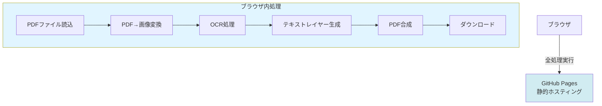
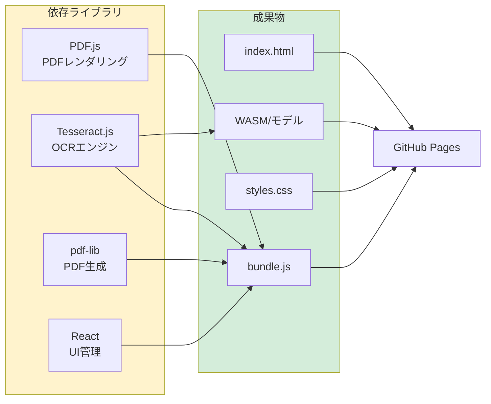
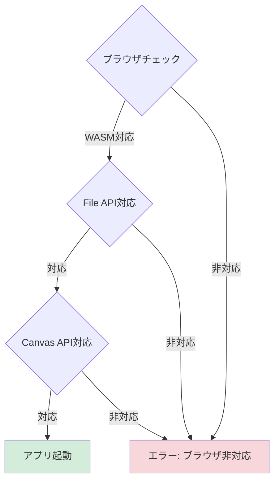
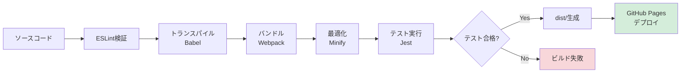
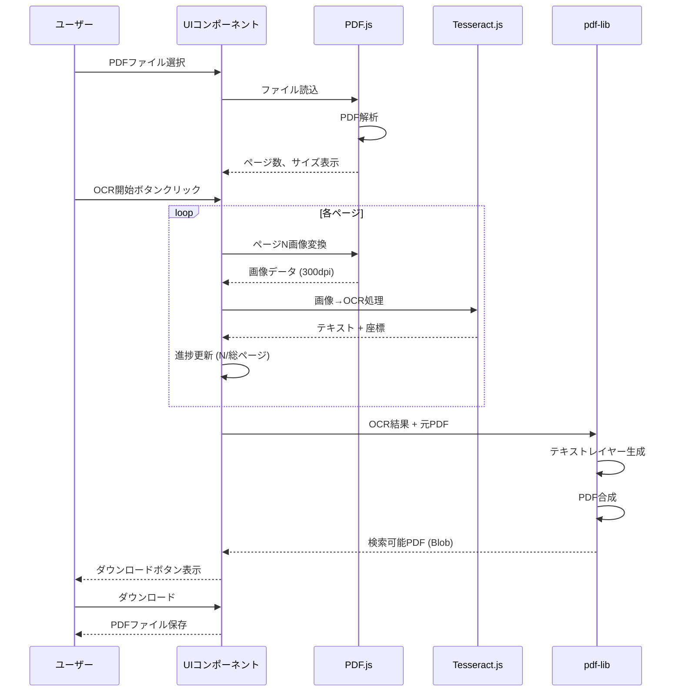
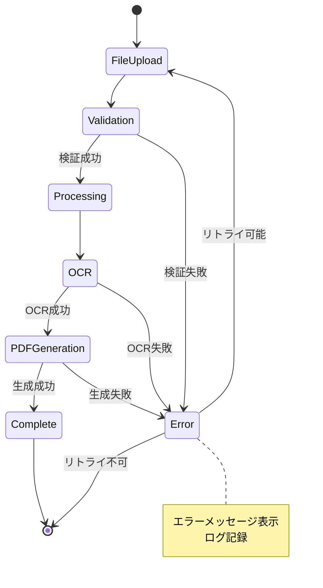

# 技術要件: OCR検索可能PDF変換Webアプリ

**機能ブランチ**: `001-OCR-PDF-Converter`  
**関連仕様**: [spec.md](./spec.md)  
**作成日**: 2026-01-10  

## 概要

本ドキュメントは、OCR検索可能PDF変換Webアプリの技術的要件を定義します。GitHub Pagesでホスティングされる完全なクライアントサイドアプリケーションとして、ブラウザ内でPDF処理を完結させます。

## アーキテクチャ原則

### クライアントサイド処理



### セキュリティ・プライバシー

- **データの外部送信禁止**: アップロードされたPDFファイルは、いかなる外部サーバーにも送信されない
- **ブラウザ内完結処理**: 全ての処理（PDF解析、OCR、PDF生成）をブラウザのメモリ内で実行
- **一時データの削除**: 処理完了後、ブラウザメモリから全データを削除
- **HTTPS通信**: GitHub Pagesは自動的にHTTPS化されるため、通信は暗号化される

## 技術スタック

### 必須ライブラリ

| ライブラリ | バージョン | 用途 | ライセンス |
|-----------|------------|------|------------|
| PDF.js | 4.0+ | PDFページを画像としてレンダリング | Apache 2.0 |
| Tesseract.js | 5.0+ | WebAssemblyベースのOCRエンジン（日本語対応） | Apache 2.0 |
| pdf-lib | 1.17+ | PDF生成・操作（テキストレイヤー追加） | MIT |
| sharp (オプション) | 0.32+ | 画像前処理（JPEG/PNG/TIFF→正規化） | Apache 2.0 |
| React (オプション) | 18.0+ | UIコンポーネント管理 | MIT |



### 開発ツール

- **パッケージマネージャ**: npm または yarn
- **バンドラー**: Webpack または Vite
- **トランスパイラ**: Babel (ES6+ → ES5)
- **CI/CD**: GitHub Actions
- **静的解析**: ESLint, Prettier
- **テスト**: Jest, React Testing Library

## パフォーマンス要件

### 処理速度

| 処理 | 目標時間 | 測定方法 |
|------|----------|----------|
| 1ページPDF (A4, 300dpi) OCR処理 | 5秒以内 (P95) | Performance API |
| 10ページPDF OCR処理 | 50秒以内 (P95) | Performance API |
| PDFアップロード→プレビュー表示 | 1秒以内 | Performance API |
| PDF生成→ダウンロード準備 | 2秒以内 | Performance API |

```mermaid
gantt
    title OCR処理タイムライン（1ページ）
    dateFormat s
    axisFormat %Ss
    
    section PDFロード
    ファイル読込 :0, 500ms
    
    section レンダリング
    PDF→画像変換 :500ms, 1000ms
    
    section OCR
    OCR処理 :1500ms, 3000ms
    
    section PDF生成
    テキストレイヤー生成 :4500ms, 500ms
    PDF合成 :5000ms, 500ms
```

### メモリ使用量

- **ピーク時メモリ**: 2GB以下（ブラウザタブあたり）
- **平均メモリ**: 500MB以下（1ページPDF処理時）
- **メモリリーク防止**: 処理完了後、全オブジェクトを明示的にnull化

### ファイルサイズ制限

- **入力ファイル**: 10MB以下（PDF, JPEG, PNG, TIFF対応）
- **出力PDF**: 入力ファイル + テキストレイヤー（通常、入力の110%程度）
- **対応ページサイズ**: A4, A3, A5, Letter, Legal, B4, B5, カスタムサイズ（最大4000×4000ピクセル）
- **アプリケーションバンドル**: 5MB以下（初回ロード）
- **OCRモデル**: 50MB以下（日本語モデル）

## ブラウザ互換性

### 対応ブラウザ

| ブラウザ | 最小バージョン | 備考 |
|----------|----------------|------|
| Google Chrome | 100+ | 推奨ブラウザ |
| Mozilla Firefox | 100+ | 完全対応 |
| Microsoft Edge | 100+ | Chromiumベース |
| Safari | 15+ | WebAssembly対応必須 |

### 必須ブラウザ機能

- WebAssembly (WASM) サポート
- File API (ファイルアップロード)
- Blob API (PDFダウンロード)
- Canvas API (画像レンダリング)
- Service Worker (オフライン対応・キャッシュ)



## GitHub Pages デプロイ要件

### ディレクトリ構造

```
/
├── index.html              # エントリーポイント
├── assets/
│   ├── js/
│   │   ├── main.bundle.js  # アプリケーションロジック
│   │   └── vendors.bundle.js # サードパーティライブラリ
│   ├── css/
│   │   └── styles.css      # スタイルシート
│   └── wasm/
│       ├── tesseract-core.wasm
│       └── jpn.traineddata # 日本語OCRモデル
├── manifest.json           # PWAマニフェスト
├── service-worker.js       # Service Worker（オフライン対応）
└── README.md               # プロジェクト説明
```

### GitHub Actions CI/CD

```yaml
# .github/workflows/deploy.yml
name: Deploy to GitHub Pages

on:
  push:
    branches: [ main ]

jobs:
  build-and-deploy:
    runs-on: ubuntu-latest
    steps:
      - uses: actions/checkout@v3
      - uses: actions/setup-node@v3
        with:
          node-version: '18'
      - run: npm ci
      - run: npm run build
      - run: npm test
      - uses: peaceiris/actions-gh-pages@v3
        with:
          github_token: ${{ secrets.GITHUB_TOKEN }}
          publish_dir: ./dist
```

### ビルドプロセス



## データフロー

### PDFアップロードからダウンロードまでの流れ



## エラーハンドリング

### エラー分類と対応

| エラー種別 | 検出タイミング | ユーザー通知 | リトライ |
|-----------|----------------|-------------|---------|
| ファイル形式エラー | アップロード時 | 「対応形式: PDF, JPEG, PNG, TIFFのみ」 | 不可 |
| ファイルサイズ超過 | アップロード時 | 「ファイルサイズは10MB以下にしてください」 | 不可 |
| PDF破損エラー | PDF解析時 | 「PDFファイルが破損しています」 | 不可 |
| OCR処理タイムアウト | OCR実行中 | 「処理がタイムアウトしました。再試行してください」 | 可 |
| メモリ不足エラー | 処理中 | 「メモリ不足です。ページ数の少ないPDFをお試しください」 | 不可 |
| ブラウザ非対応 | アプリ起動時 | 「お使いのブラウザは非対応です。Chrome/Firefox/Edgeをご利用ください」 | 不可 |



## セキュリティ要件

### Content Security Policy (CSP)

```html
<meta http-equiv="Content-Security-Policy" content="
  default-src 'self';
  script-src 'self' 'wasm-unsafe-eval';
  style-src 'self' 'unsafe-inline';
  img-src 'self' data: blob:;
  worker-src 'self' blob:;
  connect-src 'none';
">
```

### サブリソース整合性 (SRI)

- 全ての外部ライブラリ（CDN経由の場合）にSRIハッシュを適用
- 例: `<script src="https://cdn.example.com/lib.js" integrity="sha384-xxx" crossorigin="anonymous"></script>`

### プライバシー保護

- **アクセス解析**: Google Analyticsなどのトラッキングは使用しない（オプション）
- **Cookie使用**: 不要（ステートレスアプリ）
- **ローカルストレージ**: 設定保存のみ（PDF内容は保存しない）

## アクセシビリティ (a11y)

### WCAG 2.1 準拠レベル

- **目標**: AA レベル準拠
- **キーボード操作**: 全機能をキーボードのみで操作可能
- **スクリーンリーダー**: ARIA属性を適切に設定
- **コントラスト比**: 文字と背景のコントラスト比 4.5:1 以上

### アクセシビリティチェックリスト

- [ ] `alt`属性を全画像に設定
- [ ] `aria-label`をボタンとリンクに設定
- [ ] キーボードフォーカスが視覚的に識別可能
- [ ] エラーメッセージが`role="alert"`で通知される
- [ ] 進捗バーが`role="progressbar"`で実装される

## テスト要件

### テストカバレッジ目標

- **単体テスト**: 80%以上
- **統合テスト**: 主要フロー3つ（P1, P2, P3ユーザーストーリー）
- **E2Eテスト**: 1つ（PDFアップロード→OCR→ダウンロード）

### テストケース例

```javascript
// 単体テスト例
describe('PDFProcessor', () => {
  it('should render PDF page to image at 300dpi', async () => {
    const pdfFile = loadTestPDF('sample.pdf');
    const image = await PDFProcessor.renderToImage(pdfFile, 0, 300);
    expect(image.width).toBeGreaterThan(0);
    expect(image.height).toBeGreaterThan(0);
  });

  it('should reject non-PDF files', async () => {
    const jpgFile = loadTestFile('image.jpg');
    await expect(PDFProcessor.load(jpgFile)).rejects.toThrow('Invalid PDF format');
  });
});
```

## 運用要件

### 監視・ログ

- **クライアントサイドログ**: `console.error`にエラー記録（開発者ツールで確認）
- **パフォーマンス計測**: Performance API で処理時間を測定
- **エラーレート**: （オプション）Sentryなどのエラー追跡サービス統合

### ドキュメント

- **README.md**: プロジェクト概要、セットアップ手順、使用方法
- **CONTRIBUTING.md**: 開発者向けガイドライン
- **API.md**: 主要関数のAPI仕様
- **CHANGELOG.md**: バージョン履歴

## 憲法準拠チェック

本技術要件は、プロジェクト憲法の以下の原則に準拠しています：

- ✅ **テスト駆動開発**: テストカバレッジ80%以上を目標
- ✅ **セキュリティ優先**: データの外部送信禁止、CSP適用
- ✅ **パフォーマンス定量化**: 処理時間5秒以内（P95）、メモリ2GB以下
- ✅ **依存管理**: 全ライブラリをバージョン固定（package-lock.json）
- ✅ **ドキュメント品質**: Mermaid図によるフロー可視化、UTF-8エンコーディング

---

**次のステップ**: この技術要件に基づき、`/speckit.plan`コマンドで実装計画（plan.md）を作成し、アーキテクチャと開発フェーズを詳細化します。
