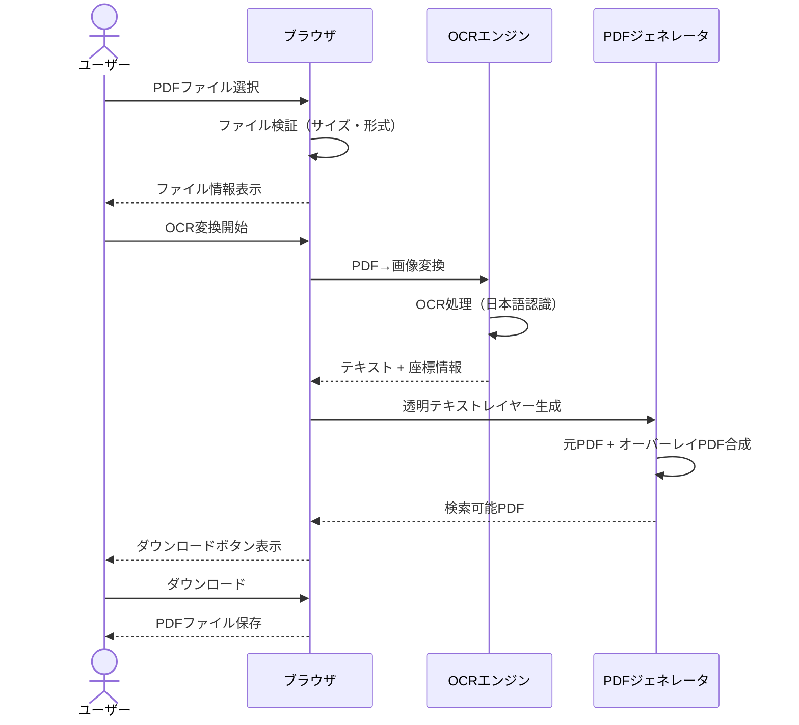
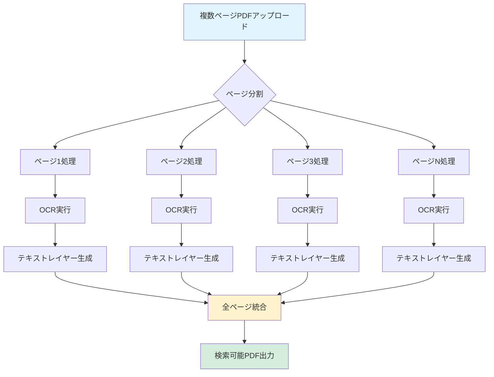
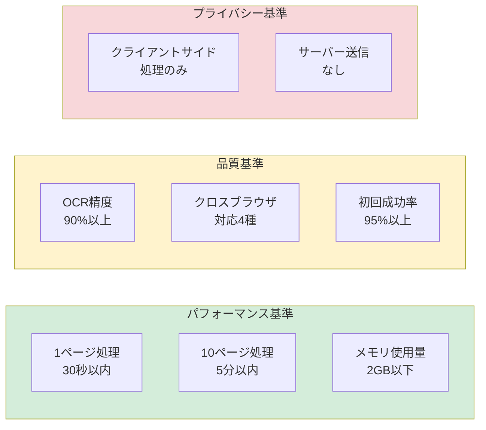
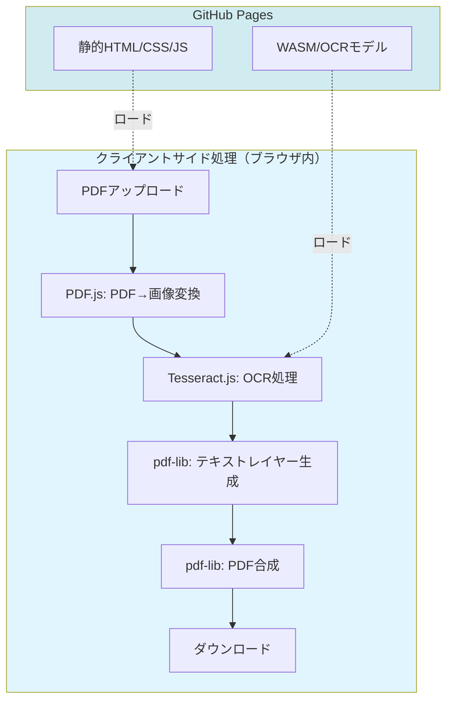

# 機能仕様: OCR検索可能PDF変換Webアプリ

**機能ブランチ**: `001-OCR-PDF-Converter`  
**作成日**: 2026-01-10  
**ステータス**: 草案  
**入力**: スキャンPDFをOCRして検索可能PDFに変換するGitHub Pagesアプリケーション

## ユーザーシナリオ & テスト *(必須)*

### ユーザーストーリー 1 - PDFアップロードとOCR変換 (優先度: P1)

ユーザーはスキャンされたPDFファイルをブラウザからアップロードし、OCR処理を実行して、検索可能なテキストレイヤーを含むPDFをダウンロードできる。

**この優先度の理由**: アプリケーションの核心機能であり、他の全機能の基盤となる。この機能なしでは製品価値がゼロ。

**独立テスト**: 1つのPDFファイル（日本語テキスト含む、A4サイズ、1ページ）をアップロードし、OCR処理後、ダウンロードしたPDFでテキスト検索（Ctrl+F）が可能であることを確認することで、完全にテスト可能。

**受入シナリオ**:

1. **Given** ユーザーがアプリケーションのホームページを開いている、**When** 「PDFを選択」ボタンをクリックし、スキャンPDFファイル（1MB以下、PDF形式）を選択する、**Then** ファイル名とファイルサイズが画面に表示される
2. **Given** PDFファイルが選択されている、**When** 「OCR変換開始」ボタンをクリックする、**Then** 処理進捗バーが表示され、OCR処理が開始される
3. **Given** OCR処理が完了している、**When** 「ダウンロード」ボタンをクリックする、**Then** 検索可能なテキストレイヤーを含むPDFファイルがダウンロードされる
4. **Given** ダウンロードしたPDFをPDFビューアー（Adobe Acrobat Reader等）で開いている、**When** テキスト検索（Ctrl+F）で文字列を検索する、**Then** OCRで認識されたテキストがハイライト表示される

---

### ユーザーストーリー 2 - 複数ページPDFのバッチ処理 (優先度: P2)

ユーザーは複数ページを含むPDFファイルをアップロードし、全ページに対してOCR処理を一括実行できる。進捗状況がリアルタイムで表示される。

**この優先度の理由**: 単ページ処理（P1）が動作すれば、ユーザーは1ページずつ処理することで回避可能。しかし、実用的なユーザー体験には複数ページ対応が不可欠。

**独立テスト**: 10ページの日本語テキストを含むPDFをアップロードし、全ページがOCR処理され、ダウンロード後に各ページでテキスト検索が可能であることを確認。

**受入シナリオ**:

1. **Given** 複数ページPDF（10ページ、合計5MB以下）が選択されている、**When** 「OCR変換開始」ボタンをクリックする、**Then** 「ページ 1/10 処理中...」のような進捗表示がリアルタイムで更新される
2. **Given** 複数ページPDFのOCR処理中、**When** 処理が50%完了した時点、**Then** 進捗バーが50%を示し、「ページ 5/10 完了」と表示される
3. **Given** 全ページの処理が完了、**When** ダウンロードしたPDFの任意のページを開く、**Then** 全ページでテキスト検索が可能である

---

### ユーザーストーリー 3 - OCR結果プレビューと編集 (優先度: P3)

ユーザーはOCR処理後、認識されたテキストをプレビュー表示し、誤認識箇所を手動修正してからPDFを生成できる。

**この優先度の理由**: OCR精度が不十分な場合のフォールバック機能。P1とP2で基本機能は完成しているため、追加の付加価値として位置付け。

**独立テスト**: OCR処理完了後、プレビュー画面でテキストを表示し、特定の文字を修正し、修正後のテキストが最終PDFに反映されていることを確認。

**受入シナリオ**:

1. **Given** OCR処理が完了している、**When** 「プレビュー」ボタンをクリックする、**Then** 認識されたテキストが各ページごとに表示される
2. **Given** プレビュー画面が表示されている、**When** 特定のテキストボックスをクリックして文字を修正する、**Then** 修正内容がリアルタイムで反映される
3. **Given** テキストを修正した、**When** 「PDF生成」ボタンをクリックする、**Then** 修正後のテキストを含む検索可能PDFがダウンロードされる

---

### エッジケース

- **大容量PDF**: 10MB以上のPDFファイルがアップロードされた場合、エラーメッセージ「ファイルサイズは10MB以下にしてください」を表示し、処理を中止する
- **対応画像ファイル**: JPEG、PNG、TIFF画像ファイルがアップロードされた場合、自動的にPDFに変換してOCR処理を実行する
- **非対応ファイル**: GIF、BMP等の非対応ファイルがアップロードされた場合、エラーメッセージ「対応形式: PDF, JPEG, PNG, TIFFのみ」を表示する
- **処理タイムアウト**: 1ページあたり10秒以上かかる場合、タイムアウトエラーを表示し、ユーザーに再試行を促す
- **非日本語PDF**: 英語やその他の言語のPDFの場合、OCRエンジンが多言語対応していれば処理可能。未対応の場合は「日本語PDFのみサポート」と表示する
- **テキストが既に埋め込まれているPDF**: OCR処理をスキップし、「このPDFは既に検索可能です」とメッセージを表示する
- **破損したPDF**: PDFの読み込みに失敗した場合、「PDFファイルが破損しています」とエラーを表示する

## 要件 *(必須)*

### 機能要件

- **FR-001**: システムは、ユーザーがブラウザからPDF/画像ファイル（10MB以下、対応形式: PDF, JPEG, PNG, TIFF）をアップロードできること
- **FR-002**: システムは、アップロードされたPDF/画像ファイルを300dpi基準で正規化し、画像としてレンダリングできること
- **FR-003**: システムは、レンダリングされた画像に対してOCR処理（日本語認識）を実行し、テキストと座標情報を抽出できること
- **FR-004**: システムは、OCR結果から透明テキストレイヤーを生成し、元のPDFに重ねて検索可能なPDFを作成できること
- **FR-005**: システムは、処理完了後、検索可能なPDFファイルをユーザーがダウンロードできること
- **FR-006**: システムは、複数ページPDFの処理進捗を「ページ X/Y 処理中」形式でリアルタイム表示できること
- **FR-007**: システムは、OCR処理中にエラーが発生した場合、エラー内容を明示的にユーザーに通知すること
- **FR-008**: システムは、GitHub Pagesで静的ホスティングできる純粋なクライアントサイドアプリケーションであること（バックエンドサーバー不要）
- **FR-009**: システムは、アップロードされたPDFファイルをサーバーに送信せず、ブラウザ内でのみ処理すること（プライバシー保護）
- **FR-010**: システムは、PDFファイル形式を検証し、非PDFファイルが選択された場合はエラーメッセージを表示すること
- **FR-011**: システムは、様々なページサイズ（A4, A3, Letter, Legal, B4, カスタムサイズ）に対応し、自動的に適切な解像度で処理できること
- **FR-012**: システムは、画像ファイル（JPEG, PNG, TIFF）を直接アップロードした場合、内部でPDFに変換してからOCR処理を実行できること

### 主要エンティティ

- **PDFファイル**: ユーザーがアップロードする入力ファイル。属性：ファイル名、ファイルサイズ、ページ数、MIME type
- **PDFページ**: PDFファイルを構成する個々のページ。属性：ページ番号、画像データ（300dpi）、幅、高さ
- **OCR結果**: OCRエンジンが出力するテキストと位置情報。属性：テキスト内容、バウンディングボックス（x1, y1, x2, y2）、信頼度スコア
- **テキストレイヤー**: OCR結果から生成される透明なテキストオーバーレイ。属性：テキスト、フォントサイズ、座標（PDF座標系）
- **検索可能PDF**: 元のPDFとテキストレイヤーを合成した最終出力ファイル。属性：ファイル名、ファイルサイズ、ページ数

## 成功基準 *(必須)*

### 測定可能な成果

- **SC-001**: ユーザーは、1ページのA4サイズPDF（日本語テキスト含む）をアップロードしてから、検索可能PDFをダウンロードするまでの時間が30秒以内に完了できる
- **SC-002**: OCR処理の精度が、日本語文字認識において90%以上の正確率を達成する（標準的な印刷品質のPDFを対象）
- **SC-003**: システムは10ページのPDFファイル（合計5MB）を処理でき、メモリ使用量がブラウザのタブあたり2GB以下に収まる
- **SC-004**: アプリケーションは、Chrome、Firefox、Edge、Safariの最新バージョンで正常に動作する（クロスブラウザ互換性）
- **SC-005**: ユーザーの95%が、初回利用時にチュートリアルなしで基本操作（PDF選択→OCR変換→ダウンロード）を完了できる
- **SC-006**: アップロードされたPDFファイルは外部サーバーに送信されず、ブラウザ内でのみ処理されることで、プライバシーが保護される

## 前提条件

- OCRエンジンとして、WebAssembly版のOnnxOCR（またはTesseract.js）をブラウザ内で実行可能であること
- PDFレンダリングには、PDF.js（Mozilla製）を使用すること
- PDF生成には、pdf-lib（JavaScriptライブラリ）を使用すること
- GitHub Pagesで静的ホスティングできるため、バックエンドAPIは不要（全処理をクライアントサイドで完結）

## 制約

- ファイルサイズ上限: 10MB（GitHub Pagesの制約とブラウザメモリ制限を考慮）
- 対応言語: 日本語のみ（将来的に多言語対応可能）
- 処理速度: 1ページあたり5秒以内（P95パーセンタイル）
- ブラウザサポート: Chrome 100+、Firefox 100+、Edge 100+、Safari 15+
- オフライン動作: 初回ロード後はネットワーク不要（Service Workerによるキャッシュ）

## 想定される技術スタック（参考）

以下は実装計画（plan.md）で詳細化されますが、仕様段階での前提として記載します。

- **フロントエンド**: HTML5, CSS3, JavaScript（Vanilla JSまたはReact/Vue.js）
- **PDFレンダリング**: PDF.js
- **OCRエンジン**: Tesseract.js（WebAssembly）またはOnnxOCR
- **PDF生成**: pdf-lib
- **ホスティング**: GitHub Pages
- **CI/CD**: GitHub Actions

## 除外事項

以下は本機能のスコープ外とします：

- **サーバーサイド処理**: バックエンドAPIやデータベースは使用しない
- **ユーザー認証**: ログイン機能は不要（誰でもアクセス可能）
- **ファイル保存**: 処理済みPDFの履歴管理や保存機能は提供しない
- **有料機能**: 全機能を無料で提供
- **モバイルアプリ**: Webアプリのみ、ネイティブアプリは対象外
- **多言語UI**: UIは日本語のみ（OCRは日本語対応だが、将来的にUI多言語化は検討可）

---

**次のステップ**: この仕様書が承認されたら、`/speckit.plan`コマンドで実装計画を作成し、技術的アーキテクチャを詳細化します。
