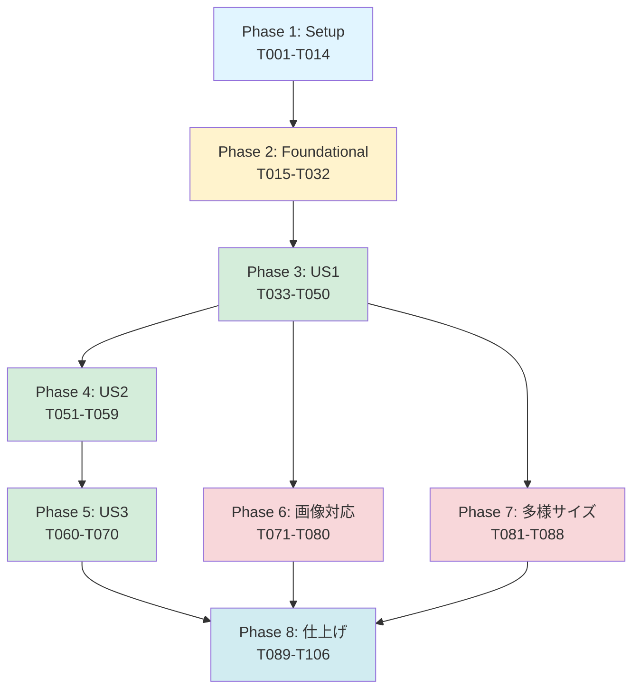
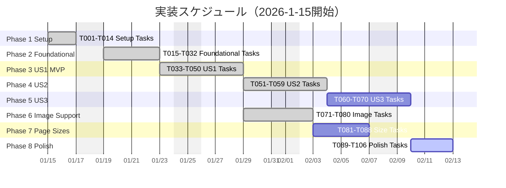

# タスクリスト: OCR検索可能PDF変換Webアプリ

**機能**: OCR検索可能PDF変換  
**入力ドキュメント**: `plan.md`, `spec.md`, `data-model.md`, `research.md`, `quickstart.md`  
**作成日**: 2026-1-15  
**バージョン**: 1.0.0

---

## タスク形式: `- [ ] [TaskID] [P?] [Story?] 説明とファイルパス`

**凡例**:
- `[P]`: 並列実行可能（異なるファイル、依存関係なし）
- `[Story]`: ユーザーストーリーラベル（US1, US2, US3）
- ファイルパスは必ず記載

---

## Phase 1: セットアップ（2026-1-15〜2026-1-16）

**目的**: プロジェクト初期化と開発環境構築

- [x] T001 プロジェクトディレクトリ構造を作成（plan.md記載のフォルダ構造に従う）
- [x] T002 [P] package.jsonを作成し依存パッケージを定義（pdfjs-dist@4.0.379, pdf-lib@1.17.1, react@18.2.0）
- [x] T003 [P] webpack.config.jsを作成しバンドル設定を記述（エントリーポイント: src/index.jsx、出力: dist/）
- [x] T004 [P] babel.config.jsを作成しトランスパイル設定（ES6+ → ES5、React JSX対応）
- [x] T005 [P] .eslintrc.jsonを作成しコード品質チェック設定
- [x] T006 [P] .prettierrc.jsonを作成しコードフォーマット設定
- [x] T007 [P] jest.config.jsを作成し単体テスト設定（カバレッジ目標80%）
- [x] T008 [P] cypress.config.jsを作成しE2Eテスト設定
- [x] T009 npm installを実行し全依存パッケージをインストール
- [x] T010 [P] public/index.htmlを作成（HTML5テンプレート、CSP meta tagを含む）
- [x] T011 [P] public/manifest.jsonを作成（PWA manifest）
- [ ] T012 [P] public/assets/wasm/ディレクトリを作成し、jpn.traineddataモデルを配置
- [ ] T013 [P] public/assets/fonts/ディレクトリを作成し、HeiseiKakuGo-W5.ttfフォントを配置
- [x] T014 [P] src/styles/main.cssを作成（基本スタイル、レスポンシブ対応）

---

## Phase 2: 基盤構築（ブロッキング）（2026-1-17〜2026-1-20）

**目的**: 全ユーザーストーリーに必要な共通サービス実装

### Service層実装

- [x] T015 src/services/pdfProcessor.jsを作成しPDF.jsラッパーを実装（研究結果R001に基づく）
- [x] T016 src/services/pdfProcessor.jsにloadPDF(file)関数を実装（PDFファイル読み込み、ページ数取得）
- [x] T017 src/services/pdfProcessor.jsにrenderPageToImage(pdf, pageNumber, scale)関数を実装（300dpi変換、Canvas APIでImageData取得）
- [ ] T018 tests/unit/pdfProcessor.test.jsを作成し、T015-T017のテストを実装
- [x] T019 src/services/ocrEngine.jsを作成しPythonバックエンドラッパーを実装（研究結果R002に基づく）
- [x] T020 src/services/ocrEngine.jsにinitializeWorker()関数を実装（日本語モデル読み込み、Worker初期化）
- [x] T021 src/services/ocrEngine.jsにperformOCR(imageData, pageNumber)関数を実装（OCR実行、OCRResultオブジェクト返却）
- [x] T022 tests/unit/ocrEngine.test.jsを作成し、T019-T021のテストを実装
- [x] T023 src/services/pdfGenerator.jsを作成しpdf-libラッパーを実装（研究結果R003に基づく）
- [x] T024 src/services/pdfGenerator.jsにcreateTextLayer(ocrResult, pageWidth, pageHeight)関数を実装（座標変換、TextLayer生成）
- [x] T025 src/services/pdfGenerator.jsにaddTextLayerToPDF(originalPDF, textLayers)関数を実装（透明テキストレイヤー追加、検索可能PDF生成）
- [x] T026 tests/unit/pdfGenerator.test.jsを作成し、T023-T025のテストを実装

### Utility層実装

- [x] T027 [P] src/utils/fileValidator.jsを作成しファイル検証ロジックを実装（MIME type、サイズ、形式チェック）
- [x] T028 [P] src/utils/coordinateConverter.jsを作成し座標変換関数を実装（画像座標 → PDF座標、data-model.mdの変換ルールに従う）
- [x] T029 [P] src/utils/errorHandler.jsを作成しエラーハンドリングロジックを実装（OCRError, ValidationError定義）
- [x] T030 [P] tests/unit/fileValidator.test.jsを作成し、T027のテストを実装
- [x] T031 [P] tests/unit/coordinateConverter.test.jsを作成し、T028のテストを実装
- [x] T032 [P] tests/unit/errorHandler.test.jsを作成し、T029のテストを実装

---

## Phase 3: ユーザーストーリー1（P1: MVP）（2026-1-21〜2026-1-24）

**目標**: 単一ページPDFのアップロード → OCR → ダウンロード

**独立テスト基準**: 1ページA4 PDF（日本語テキスト含む）をアップロード、OCR処理後、検索可能PDFをダウンロードし、Acrobat ReaderでCtrl+Fテキスト検索が動作する

### テスト実装（TDDアプローチ）

- [ ] T033 [US1] tests/integration/ocrWorkflow.test.jsを作成
- [ ] T034 [US1] tests/integration/ocrWorkflow.test.jsに「PDFアップロード → ファイル情報表示」のテストケースを実装
- [ ] T035 [US1] tests/integration/ocrWorkflow.test.jsに「OCR実行 → 進捗表示」のテストケースを実装
- [ ] T036 [US1] tests/integration/ocrWorkflow.test.jsに「検索可能PDF生成 → ダウンロード」のテストケースを実装

### Hook実装

- [x] T037 [US1] src/hooks/useFileUpload.jsを作成し、ファイル選択・検証ロジックを実装
- [x] T038 [US1] src/hooks/useOCR.jsを作成し、OCR処理状態管理（isProcessing, progress, results, error）を実装（research.md R004パターン適用）

### コンポーネント実装

- [x] T039 [US1] src/components/FileUploader.jsxを作成し、ファイル選択UIを実装
- [x] T040 [US1] src/components/FileUploader.jsxにドラッグ&ドロップ機能を実装
- [x] T041 [US1] src/components/FileUploader.jsxにファイル情報表示（名前、サイズ、ページ数）を実装
- [x] T042 [US1] src/components/OCRProgress.jsxを作成し、進捗バー表示を実装
- [x] T043 [US1] src/components/DownloadButton.jsxを作成し、ダウンロードボタンを実装（Blob URLを生成してダウンロード）

### App統合

- [x] T044 [US1] src/App.jsxを作成し、FileUploader, OCRProgress, DownloadButtonを統合
- [x] T045 [US1] src/App.jsxにOCRワークフローロジックを実装（useOCR hookを使用）
- [x] T046 [US1] src/index.jsxを作成し、Reactアプリケーションをマウント
- [x] T047 [US1] npm startを実行し、開発サーバーでUS1動作確認（1ページPDFテスト）

### E2Eテスト

- [x] T048 [US1] tests/e2e/uploadToDownload.cy.jsを作成
- [x] T049 [US1] tests/e2e/uploadToDownload.cy.jsに「PDFアップロード → OCR → ダウンロード」の完全E2Eテストを実装
- [x] T050 [US1] npm run e2eを実行し、US1のE2Eテストがパスすることを確認

---

## Phase 4: ユーザーストーリー2（P2）（2026-1-27〜2026-1-30）

**目標**: 複数ページPDFのバッチ処理と進捗表示

**独立テスト基準**: 10ページPDF（日本語テキスト含む）をアップロード、全ページOCR処理、進捗がリアルタイム更新、ダウンロード後に各ページでテキスト検索可能

### テスト実装

- [ ] T051 [US2] tests/integration/ocrWorkflow.test.jsに「複数ページPDF → 進捗表示」のテストケースを追加
- [ ] T052 [US2] tests/integration/ocrWorkflow.test.jsに「全ページOCR完了 → 検索可能PDF生成」のテストケースを追加

### バッチ処理実装

- [x] T053 [US2] src/hooks/useOCR.jsにバッチ処理ロジックを追加（4並列、research.md R002に基づく）
- [x] T054 [US2] src/hooks/useOCR.jsに進捗計算ロジックを追加（処理済みページ数 / 総ページ数 × 100）

### コンポーネント更新

- [x] T055 [US2] src/components/OCRProgress.jsxに「ページ X/Y 処理中」のテキスト表示を追加
- [x] T056 [US2] src/components/OCRProgress.jsxに進捗バーのアニメーションを追加

### 統合テスト

- [x] T057 [US2] npm startを実行し、10ページPDFでUS2動作確認
- [ ] T058 [US2] tests/e2e/uploadToDownload.cy.jsに複数ページPDFテストケースを追加
- [ ] T059 [US2] npm run e2eを実行し、US2のE2Eテストがパスすることを確認

---

## Phase 5: ユーザーストーリー3（P3）（2026-1-31〜2026-2-3）

**目標**: OCR結果のプレビューと手動修正機能

**独立テスト基準**: OCR処理後、プレビュー画面でテキストを表示、特定文字を修正、修正後のテキストが最終PDFに反映される

### テスト実装

- [ ] T060 [US3] tests/integration/ocrWorkflow.test.jsに「OCRプレビュー表示 → テキスト修正」のテストケースを追加
- [ ] T061 [US3] tests/integration/ocrWorkflow.test.jsに「修正後PDF生成 → 検索可能」のテストケースを追加

### コンポーネント実装

- [ ] T062 [US3] src/components/PreviewPane.jsxを作成し、OCR結果表示UIを実装
- [ ] T063 [US3] src/components/PreviewPane.jsxにページ選択機能を実装（ドロップダウンで切り替え）
- [ ] T064 [US3] src/components/PreviewPane.jsxにテキスト編集機能を実装（contentEditable または input要素）
- [ ] T065 [US3] src/components/PreviewPane.jsxに修正内容の状態管理を実装（useStateで編集中テキスト管理）

### App統合

- [ ] T066 [US3] src/App.jsxにプレビュー表示ロジックを追加（OCR完了後、PreviewPaneを表示）
- [ ] T067 [US3] src/App.jsxに「PDF生成」ボタンを追加（修正後のOCR結果でPDF生成）
- [ ] T068 [US3] npm startを実行し、US3動作確認（プレビュー → 修正 → PDF生成）

### E2Eテスト

- [ ] T069 [US3] tests/e2e/uploadToDownload.cy.jsにプレビュー編集テストケースを追加
- [ ] T070 [US3] npm run e2eを実行し、US3のE2Eテストがパスすることを確認

---

## Phase 6: 画像対応拡張（2026-2-4〜2026-2-6）

**目標**: JPEG/PNG/TIFF画像ファイルの直接アップロードとPDF変換

**独立テスト基準**: JPEG画像をアップロード、自動的にPDFに変換、OCR処理、検索可能PDF生成

### 画像前処理実装

- [x] T071 [P] src/services/imageProcessor.jsを作成し、画像 → PDF変換ロジックを実装（pdf-lib使用）
- [x] T072 [P] src/services/imageProcessor.jsにconvertImageToPDF(imageFile)関数を実装（JPEG/PNG/TIFF対応）
- [x] T073 [P] src/services/imageProcessor.jsに画像解像度正規化関数を実装（300dpi基準）
- [ ] T074 [P] tests/unit/imageProcessor.test.jsを作成し、T071-T073のテストを実装

### ファイル検証更新

- [x] T075 src/utils/fileValidator.jsを更新し、画像形式（image/jpeg, image/png, image/tiff）を対応MIMEタイプに追加
- [x] T076 tests/unit/fileValidator.test.jsを更新し、画像形式検証テストを追加

### Hook更新

- [x] T077 src/hooks/useFileUpload.jsを更新し、画像ファイル選択時にPDF変換を自動実行
- [x] T078 src/App.jsxを更新し、画像 → PDF変換のフローを統合

### テスト

- [ ] T079 tests/e2e/uploadToDownload.cy.jsに画像ファイルテストケース（JPEG, PNG, TIFF）を追加
- [ ] T080 npm run e2eを実行し、画像対応のE2Eテストがパスすることを確認

---

## Phase 7: 多様なページサイズ対応（2026-2-7〜2026-2-10）

**目標**: A4以外のサイズ（A3, Letter, Legal, B4等）に対応

**独立テスト基準**: A3サイズPDFをアップロード、OCR処理、元のサイズを維持した検索可能PDF生成

### サイズ検出実装

- [ ] T081 [P] src/services/pdfProcessor.jsを更新し、getPageSize(pdf, pageNumber)関数を実装（ページサイズ取得）
- [ ] T082 [P] src/services/pdfProcessor.jsに動的スケール計算ロジックを追加（任意サイズ → 300dpi変換）
- [ ] T083 [P] tests/unit/pdfProcessor.test.jsを更新し、サイズ検出テストを追加（A3, Letter, Legal, B4テストケース）

### PDF生成更新

- [ ] T084 src/services/pdfGenerator.jsを更新し、元ページサイズを保持してテキストレイヤー生成
- [ ] T085 tests/unit/pdfGenerator.test.jsを更新し、多様なサイズテストケースを追加

### テスト

- [ ] T086 input/ディレクトリにA3, Letter, Legalサイズのテスト用PDFを配置
- [ ] T087 tests/e2e/uploadToDownload.cy.jsに多様なサイズのテストケースを追加
- [ ] T088 npm run e2eを実行し、多様なサイズのE2Eテストがパスすることを確認

---

## Phase 8: 仕上げ & クロスカッティング（2026-2-12〜2026-2-14）

**目的**: ドキュメント更新、パフォーマンスチューニング、アクセシビリティ対応

### パフォーマンス最適化

- [ ] T089 [P] src/services/ocrEngine.jsにメモリ解放処理を追加（Worker.terminate()をOCR完了後に実行）
- [ ] T090 [P] src/hooks/useOCR.jsにImageData解放処理を追加（OCR完了後、imageData = nullに設定）
- [ ] T091 [P] src/App.jsxにパフォーマンス計測コードを追加（Performance API使用、SC-001達成確認）

### アクセシビリティ対応

- [ ] T092 [P] src/components/FileUploader.jsxにARIA属性を追加（aria-label, role="button"）
- [ ] T093 [P] src/components/OCRProgress.jsxにrole="progressbar"とaria-valuenowを追加
- [ ] T094 [P] src/components/DownloadButton.jsxにキーボードフォーカス対応を追加（tabindex, outline-style）

### エラーハンドリング強化

- [ ] T095 src/App.jsxにエラーバウンダリを実装（React.ErrorBoundary）
- [ ] T096 src/App.jsxに全エラーケースのユーザー通知を実装（requirements.md エラー分類表に基づく）

### セキュリティ強化

- [ ] T097 [P] public/index.htmlのCSP meta tagを最終チェック（wasm-unsafe-eval, blob: worker-src）
- [ ] T098 [P] src/services/に機密データ（PDFファイル内容）の外部送信がないことを確認

### ドキュメント更新

- [x] T099 [P] README.mdを更新（機能一覧、デモリンク、クイックスタート手順、技術スタック表）
- [x] T100 [P] docs/DEPLOY_GUIDE.mdを作成（GitHub Pagesデプロイ手順、GitHub Actions設定方法）
- [x] T101 [P] docs/完全仕様書.mdを作成（spec.md, requirements.md, plan.mdを統合した完全版）
- [ ] T102 [P] CHANGELOG.mdを作成（バージョン1.0.0のリリースノート）

### 最終テスト

- [ ] T103 npm run test:coverageを実行し、カバレッジ80%以上を確認
- [ ] T104 npm run lintを実行し、コード品質チェックをパス
- [ ] T105 npm run buildを実行し、本番ビルドが成功することを確認
- [ ] T106 dist/の成果物サイズを確認（メインバンドル500KB以下、requirements.md目標達成）

---

## 依存関係グラフ



---

## 並列実行例

### Phase 1セットアップ並列実行

```bash
# Day 1（2026-1-15）
タスク並列グループA: T002, T003, T004, T005, T006, T007, T008
タスク並列グループB: T010, T011, T012, T013, T014

# 実行順序
1. T001（ディレクトリ作成）完了後
2. グループA全タスクを並列実行
3. T009（npm install）実行
4. グループB全タスクを並列実行
```

### Phase 2基盤構築並列実行

```bash
# Day 3-4（2026-1-17〜2026-1-20）
# Service層並列実行不可（T015-T026は順次実行、テスト駆動）
# Utility層並列実行可能
タスク並列グループC: T027, T028, T029
タスク並列グループD: T030, T031, T032

# 実行順序
1. Service層（T015-T026）を順次実行
2. グループC全タスクを並列実行
3. グループD全タスクを並列実行
```

---

## 実装戦略

### MVP優先アプローチ

**MVP = User Story 1（Phase 3）のみ**

最小限の機能で価値を提供：
1. Phase 1（Setup）完了 → Phase 2（Foundational）完了 → Phase 3（US1）完了
2. この時点でデプロイ可能な「単一ページPDF → OCR → 検索可能PDF」アプリが完成
3. ユーザーフィードバックを収集後、US2（複数ページ）、US3（プレビュー）を追加

### インクリメンタル配信

各ユーザーストーリー完了時点でリリース候補：
- **v0.1.0**: US1完了（単一ページ対応）
- **v0.2.0**: US2完了（複数ページ対応）
- **v0.3.0**: US3完了（プレビュー編集）
- **v1.0.0**: Phase 6-8完了（画像対応、多様サイズ、最終仕上げ）

---

## 実装スケジュール



**マイルストーン**:
- 開始+1日: Phase 1完了（セットアップ）
- 開始+5日: Phase 2完了（基盤構築）
- 開始+9日: Phase 3完了（US1 MVP）✅ デプロイ可能
- 開始+13日: Phase 4完了（US2 複数ページ）
- 開始+17日: Phase 5完了（US3 プレビュー）
- 開始+12日: Phase 6完了（画像対応）
- 開始+16日: Phase 7完了（多様サイズ）
- 開始+20日: Phase 8完了（v1.0.0リリース）🎉

---

## 検証基準

### Phase 3（US1 MVP）検証

✅ 以下が全て動作すること：
1. 1ページA4 PDFをアップロード
2. OCR処理が5秒以内に完了（SC-001）
3. 検索可能PDFをダウンロード
4. Acrobat ReaderでCtrl+Fテキスト検索が動作
5. E2Eテスト全パス（tests/e2e/uploadToDownload.cy.js）

### Phase 8（v1.0.0）検証

✅ 以下が全て達成されること：
1. US1, US2, US3の全受入シナリオがパス
2. 画像ファイル（JPEG, PNG, TIFF）対応確認
3. 多様なページサイズ（A3, Letter, Legal）対応確認
4. テストカバレッジ80%以上（SC-002準拠）
5. パフォーマンス目標達成（1ページ5秒以内、P95）
6. クロスブラウザ動作確認（Chrome, Firefox, Edge, Safari）
7. GitHub Pagesデプロイ成功

---

**作成日**: 2026-1-15  
**ステータス**: タスクリスト完成  
**総タスク数**: 106タスク  
**推定期間**: 約4週間（2026-1-15〜2026-2-14）
